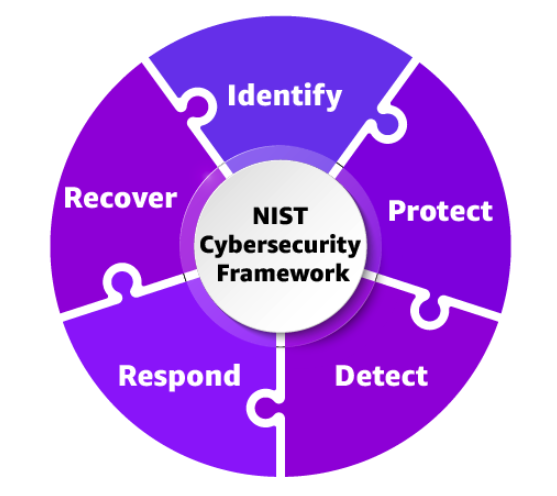
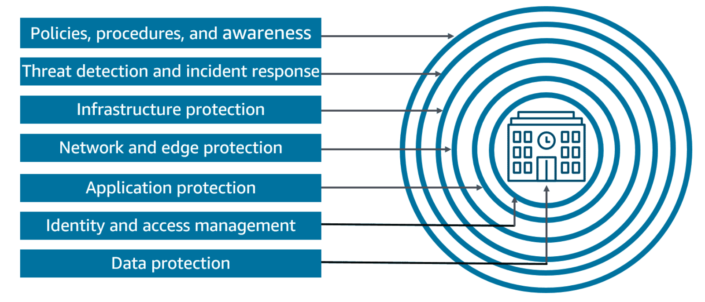
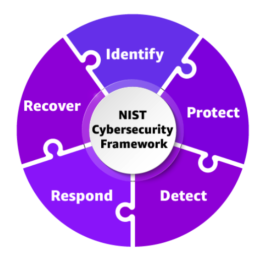
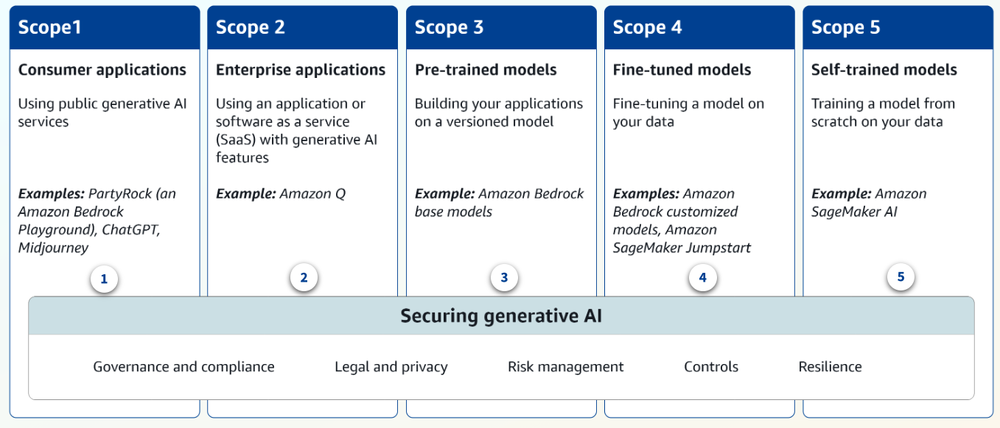
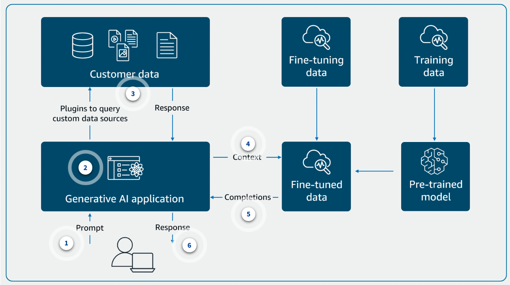
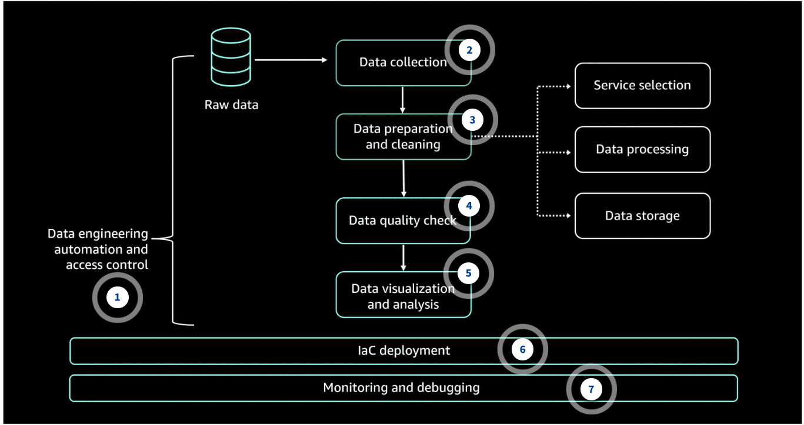

# Week 11: Governance, Compliance, and Security for Responsible AI

* back to AWS Cloud Institute repo's root [aci.md](../aci.md)
* back to [AI for Developers](./ai-for-developers.md)
* back to repo's main [README.md](../../../README.md)

## AWS Well-Architected Generative AI Lens and Responsible AI

In today's rapidly evolving technological landscape, organizations implementing AI systems must establish robust frameworks for security, governance, and compliance. These fundamental concepts are crucial for ensuring that AI implementations not only drive innovation but also maintain trust, protect sensitive information, and adhere to regulatory requirements.

As organizations increasingly adopt advanced AI capabilities, understanding and implementing these concepts becomes essential for creating responsible and trustworthy AI solutions that align with business objectives while managing potential risks. This lesson explores these concepts through the lens of the AWS Well-Architected Framework, specifically focusing on how they apply to generative AI implementations.

### AWS Well-Architected Generative AI Lens

The AWS Well-Architected Generative AI Lens serves as an essential resource for organizations looking to use generative AI technologies on AWS. As enterprises increasingly adopt generative AI to drive innovation and solve complex problems, this lens extends the Well-Architected Framework to address the unique considerations and opportunities presented by generative AI technologies.

The lens provides comprehensive guidance across six fundamental pillars that are crucial for building well-architected generative AI applications.

* **Operational excellence:** Achieve consistent model output quality, monitor and manage operational health, maintain traceability, automate lifecycle management, and determine when to execute model customization.
* **Security:** Protect generative AI endpoints, mitigate risks of harmful outputs and excessive agency, monitor and audit events, secure prompts, and remediate model poisoning risks.
* **Reliability:** Handle throughput requirements, maintain reliable component communication, implement observability, manage failures gracefully, version artifacts, ensure proper distribution of inference workloads, and verify completion of distributed computation tasks.
* **Performance efficiency:** Capture and improve model performance, maintain acceptable performance levels, optimize computation resources, and improve data retrieval performance.
* **Cost optimization:** Select cost-optimized models, balance cost and performance of inference, engineer prompts for cost efficiency, and optimize vector stores and agent workflows.
* **Sustainability:** Minimize computational resources across all aspects of AI operations, including training, customization, hosting, data processing, and storage. Use model efficiency techniques and serverless architectures.

#### AWS Well-Architected Framework integration

The focus on security, governance, and compliance is aligned with the AWS Well-Architected Generative AI Lens, which emphasizes these elements as critical components for building responsible AI applications. This lens specifically highlights security as one of its key pillars, addressing crucial aspects such as protecting AI endpoints, mitigating risks of harmful outputs, and implementing proper monitoring and audit mechanisms.

Through this lens, organizations can better understand how to design, deploy, and operate generative AI applications by implementing robust security controls through the security pillar. They can establish strong governance mechanisms through the ***operational excellence*** pillar and maintain compliance requirements through both ***security*** and ***reliability** pillars. This comprehensive approach ensures that organizations can maximize business value while maintaining the highest standards of security, governance, and compliance in their AI implementations.

#### Core components of responsible AI implementation

Governance, compliance, and security share some distinct differences and similar goals. The following list describes the purpose of each:

* Governance ensures that an organization can add value and manage risk in business operations.
* Compliance ensures normative adherence to requirements across an organization's functions.
* Security ensures that confidentiality, integrity, and availability are maintained for organizational data, information assets, and infrastructure. Organizations often refer to this function as ***information security*** or ***cybersecurity***.

Organizations implement governance, compliance, and security functions to assure that they can deliver on their primary business. Sometimes, the requirements for these functions are referred to as the most important requirements, or the things that must not be sacrificed in product development or delivery.

---

### High-Level Strategies

Developing a high-level governance and compliance strategy for an organization producing AI solutions is important for ensuring the responsible deployment of these technologies. To begin, you should consider the following:

* Establish an AI governance framework.
* Address AI compliance considerations.

#### Governance Framework Examples

##### 1. Establish an Al governance board or committee

This cross-functional team should include representatives from various departments, such as legal, compliance, data privacy, and subject matter experts in Al development.

##### 2. Define roles and responsibilities

Clearly outline the roles and responsibilities of the governance board, including oversight, policymaking, risk assessment, and decision-making processes.

##### 3. Implement policies and procedures

Develop comprehensive policies and procedures that address the entire Al lifecycle, from data management to model deployment and monitoring.

---

#### Monitoring strategies

Monitoring an AI system is necessary to make sure that its performance, reliability, and compliance align with the intended use case. If the use case requires reporting of metrics or infrastructure standards, those are aspects that should be monitored in a governance strategy. Effective monitoring can also help identify issues, optimize system performance, and maintain overall system health.

Here are some examples of key aspects to consider when monitoring an AI system for governance and compliance. These are common aspects that can impact meeting standards for compliance. They should be considered when applying a governance strategy

##### Performance metrics

You can monitor the performance of an AI system by tracking metrics, such as the following:

* **Model accuracy:** The proportion of correct predictions made by the mode
* **Precision:** The ratio of true positive predictions to the total number of positive predictions made by the model
* **Recall:** The ratio of true positive predictions to the total number of actual positive instances in the data
* **F1-score**: The harmonic mean of precision and recall, which provides a balanced measure of model performance
* **Latency:** The time taken by the model to make a prediction, which is an important measure of a model's practical performance

These metrics can help you assess the effectiveness of an AI model and identify areas for improvement.

##### Infrastructure monitoring

You should monitor the underlying infrastructure that supports an AI system, including the following: 

* Compute resources (for example, CPU, memory, and GPU)
* Network performance
* Storage
* System logs

This can help you identify resource bottlenecks, capacity planning issues, and potential system failures.

##### Monitoring for bias and fairness

You must regularly assess an AI system for potential biases and unfair outcomes, especially in sensitive domains such as healthcare, finance, and HR. This can help confirm that the AI system is making fair and unbiased decisions.

##### Monitoring for compliance and responsible AI

You must make sure that the AI system's operations and outputs adhere to relevant regulations, industry standards, and responsible guidelines. You should monitor for any potential violations or issues that could raise compliance or responsible AI concerns.

---

### Knowledge Check

#### A developer is implementing a generative AI application and needs to ensure consistent model output quality while maintaining automated lifecycle management. Which pillar of the AWS Well-Architected Generative AI Lens should they focus on MOST?

* Operational excellence

Wrong answers:

* Performance efficiency
* Cost optimization
* Reliability

##### Explanation

This pillar specifically focuses on achieving consistent model output quality and implementing automated lifecycle management processes for AI systems.

The other options are incorrect for the following reasons:

* Performance efficiency focuses on model performance optimization and computational resource management, not lifecycle management.
* Cost optimization deals with selecting cost-effective models and optimizing inference costs.
* Reliability focuses on handling throughput and managing failures, not maintaining output quality consistency.

#### A developer needs to implement a solution that protects AI endpoints and mitigates risks of harmful outputs while maintaining proper audit mechanisms. Which pillar of the AWS Well-Architected Generative AI Lens addresses these requirements MOST directly?

* Security

Wrong answers:

* Sustainability
* Operational excellence
* Performance efficiency

##### Explanation

The security pillar specifically addresses protecting AI endpoints, mitigating risks of harmful outputs, and implementing robust monitoring and audit mechanisms.

The other options are incorrect for the following reasons:

* Sustainability focuses on minimizing computational resources and improving efficiency of AI operations.
* Operational excellence deals with model output quality and lifecycle management, not security controls.
* Performance efficiency concentrates on model performance and resource optimization, not security measures.

#### A developer is monitoring an AI system for healthcare patient diagnosis and notices that the model consistently shows lower accuracy for certain demographic groups. What should be their MOST immediate focus for investigation?

* Monitoring for bias and fairness in the model's predictions

Wrong answers:

* Tracking the F1-score performance metrics
* Analyzing system infrastructure logs
* Measuring model prediction latency

##### Explanation

When an AI system shows varying accuracy across different demographic groups in healthcare, it indicates potential bias issues that could lead to unfair treatment and serious compliance concerns.

The other options are incorrect for the following reasons:

* F1-score metrics, although important, do not specifically address the demographic disparity issue that requires immediate attention.
* System infrastructure logs focus on technical performance rather than addressing fairness concerns in healthcare decisions.
* Model prediction latency relates to speed of delivery rather than addressing potential discriminatory outcomes.

---

### Summary

* The AWS Well-Architected Generative AI Lens provides guidance across six pillars: operational excellence, security, reliability, performance efficiency, cost optimization, and sustainability.
* The framework emphasizes security, governance, and compliance as critical components for building responsible and trustworthy AI solutions while managing potential risks.
* Core implementation components include governance (value and risk management), compliance (requirement adherence), and security (confidentiality, integrity, and availability).
* High-level strategies for responsible AI implementation include establishing an AI governance framework, addressing AI compliance considerations, and implementing monitoring strategies for performance, bias, and compliance.
* Core components of responsible AI implementation consist of governance for business value and risk management, compliance for requirement adherence, and security for maintaining confidentiality, integrity, and availability.
* Monitoring aspects for AI systems encompass performance metrics, infrastructure monitoring, bias and fairness tracking, and compliance and responsible AI oversight.

---

## Governance for Responsible AI Accountability

### Governance for AI systems

* Managing, optimizing, and scaling the organizational AI initiative is at the core of the governance perspective. Incorporating AI governance into an organization’s AI strategy is instrumental in building trust. Governance also helps in enabling the deployment of AI technologies at scale and overcoming challenges to drive business transformation and growth.
* Governance and compliance are important for AI systems used in business to ensure responsible and trustworthy AI practices. As AI systems become more prevalent in decision-making processes, it is essential to have robust governance frameworks and compliance measures in place to mitigate risks. These risks include bias, privacy violations, and unintended consequences.
* Governance helps organizations establish clear policies, guidelines, and oversight mechanisms designed to ensure that AI systems align with legal and regulatory requirements, in addition to ethical principles and societal values. Therefore, governance protects the organization from potential legal and reputational risks. It also fosters public trust and confidence in the responsible deployment of AI technologies within the business context.

---

### Governance strategies

When working with generative AI solutions, it's important to establish and follow governance strategies to ensure responsible development and deployment.

---

### Five approaches for implementing governance strategies

The five key approaches for implementing effective governance strategies provide a comprehensive framework for ensuring consistent, accountable, and transparent decision-making across your team.

#### 1. Policies

Develop clear and comprehensive policies that outline the organization's approach to generative AI, including principles, guidelines, and responsible AI considerations. Here are some common characteristics of policies:

* Policies should address areas such as data management, model training, output validation, safety, and human oversight.
* Policies should cover aspects like intellectual property, bias mitigation, and privacy protection.
* Policies must be regularly reviewed and updated to keep pace with evolving technology and regulatory requirements.

#### 2. Review frequency

Implement a regular review process to assess the performance, safety, and responsible AI implications of generative AI solutions. Here are some common tasks to include in the review process:

* The review process should involve a combination of technical, legal, and responsible AI reviews at different stages of the development and deployment lifecycle.
* A clear timeline should be established for reviews, such as monthly, quarterly, or biannually, depending on the complexity and risk profile of the solutions.
* The review process must include diverse perspectives from stakeholders, including subject matter experts, legal and compliance teams, and end users.

#### 3. Review strategies

Develop comprehensive review strategies that cover both technical and nontechnical aspects of the generative AI solutions. Here is some suggested guidance for review strategies:

* Technical reviews should focus on model performance, data quality, and the underlying algorithms' robustness.
* Nontechnical reviews should assess the solutions' alignment with organizational policies, responsible AI principles, and regulatory requirements.
* Testing and validation procedures should be incorporated to validate the outputs of the generative AI solutions before deployment.
* Clear decision-making frameworks should be established to determine when and how to intervene or modify the solutions based on the review findings.

#### 4. Transparency standards

Commit to maintaining high standards of transparency in the development and deployment of generative AI solutions by ensuring the following:

* Include publishing information about the AI models, their training data, and the key decisions made during the development process.
* Provide clear and accessible documentation on the capabilities, limitations, and intended use cases of the generative AI solutions.
* Establish channels for stakeholders, including end users, to provide feedback and raise concerns about the solutions.

#### 5. Team training requirements

Make sure that all team members involved in the development and deployment of generative AI solutions are adequately trained on relevant policies, guidelines, and best practices. Some suggestions for team training include the following:

* Provide comprehensive training on bias mitigation and responsible AI practices.
* Encourage cross-functional collaboration and knowledge sharing to foster a culture of responsible AI development.
* Consider implementing ongoing training and certification programs to keep team members up to date with the latest advancements and regulatory changes.

---

### Data Governance

Data governance strategies for AI and generative AI workloads involve an approach to managing the data lifecycle, from data collection and storage to data usage and security.

#### Data quality and integrity

To maintain the quality and integrity of your data, follow these best practices:

* Establish data quality standards and processes to ensure the accuracy, completeness, and consistency of data used for AI and generative AI models.
* Implement data validation and cleansing techniques to identify and address data anomalies and inconsistencies.
* Maintain data lineage and provenance to understand the origin, transformation, and usage of data.
  * *Data lineage* and *provenance* are concepts that describe the origins, history, and transformations of data as it flows through an organization.

#### Data protection and privacy

To maintain data protection and privacy, implement the following best practices:

* Develop and enforce data privacy policies that protect sensitive or personal information.
* Implement access controls, encryption, and other security measures to safeguard data from unauthorized access or misuse.
* Establish data breach response and incident management procedures to mitigate the impact of any data security incidents.

##### Data lifecycle management

Some strategies for data lifecycle management include the following:

* Classify and catalog data assets based on their sensitivity, value, and criticality to the organization.
* Implement data retention and disposition policies to support the appropriate storage, archiving, and deletion of data.
* Develop data backup and recovery strategies to achieve business continuity and data resilience.

#### Data sharing and collaboration

Some best practices to ensure responsible AI include the following:

* Establish responsible frameworks and guidelines for the development and deployment of AI and generative AI models, addressing issues like bias, fairness, transparency, and accountability.
* Implement processes to monitor and audit AI and generative AI models for potential biases, fairness issues, and unintended consequences.
* Educate and train AI development teams on responsible AI practices.

#### Governance structures and roles

Strategies to establish governance structures and roles include the following:

* Establish a data governance council or committee to oversee the development and implementation of data governance policies and practices.
* Define clear roles and responsibilities for data stewards, data owners, and data custodians to ensure accountable data management.
* Provide training and support to AI and machine learning (ML) practitioners and data users on data governance best practices.

#### Responsible AI

Strategies for managing data sharing and collaboration include the following:

* Develop data sharing agreements and protocols to facilitate the secure and controlled exchange of data across organizational boundaries.
* Implement data virtualization or federation techniques to provide access to distributed data sources without compromising data ownership or control.
* Foster a culture of data-driven decision-making and collaborative data governance across the organization.

---

### Data governance considerations

The following concepts are important data governance considerations for the successful management and deployment of AI workloads. They help ensure the quality, integrity, and governance of the data that underpins the development, training, and deployment of AI models.

#### Data analysis

Data analysis methods are used to understand the characteristics, patterns, and relationships in the data used for AI workloads. These methods help developers gain insights into the data and include the following:

* Statistical analysis
* Data visualization
* Exploratory data analysis (EDA), which is a task to discover patterns, understand relationships, validate assumptions, and identify anomalies in data

#### Data lifecycles

*Data lifecycle* refers to the management of data throughout its entire lifespan, from creation to eventual disposal or archiving. In the context of AI workloads, the lifecycle of data that is used to train and deploy AI models encompasses the following stages:

* Collection
* Processing
* Storage
* Consumption
* Disposal or archiving

#### Data logging

Data logging involves the systematic recording of data related to the processing of an AI workload. This can include the following:

* Tracking inputs
* Tracking outputs
* Model performance metrics
* System events

Effective data logging is necessary for debugging, monitoring, and understanding the behavior of AI systems.

#### Data monitoring

Data monitoring involves the ongoing observation and analysis of data used in AI workloads. This can include the following: 

* Monitoring data quality
* Identifying anomalies (An *anomaly* is an unexpected data point that significantly deviates from the norm.)
* Tracking data drift (*Data drift* is when the distribution of input data changes over time.)

Monitoring also helps to confirm that the data being used for training and inference remains relevant and representative.

#### Data residency

*Data residency* refers to the physical location where data is stored and processed. In the context of AI workloads, data residency considerations might include the following:

* Compliance with data privacy regulations
* Data sovereignty requirements
* Proximity of data to the compute resources used for training and inference

#### Data retention

Data retention policies define how long data should be kept for AI workloads. This can be influenced by factors such as the following:

* Regulatory requirements
* Maintaining historical data for model retraining
* Cost of data storage

Effective data retention strategies can help organizations manage the lifecycle of data used in their AI systems.

---

### Source citation and data origins documentation

Source citation and documenting data origins are essential tasks that contribute to securing your AI systems. These tasks help ensure the transparency, traceability, and accountability of the data and information used in the AI system. This is important for maintaining the integrity and trustworthiness of the system. These tasks involve providing information about the sources of the data used to train the generative AI model and the provenance of the data. The following tabs describe source citation and documenting data origins.

#### Source Citation

Source citation in generative AI refers to the act of properly attributing and acknowledging the sources of the data used to train a model.

It is necessary to identify the sources from which the training data was collected, such as the following:

* Datasets
* Databases
* Other sources

In addition, it is necessary to identify any relevant licenses, terms of use, or permissions associated with the data.

Accurate source citation helps users and stakeholders understand the origins of the information used to generate the AI-produced content. This prepares them to assess the reliability and trustworthiness of the output.

#### Documenting Data Origins

Documenting data origins in the context of generative AI involves providing detailed information about the provenance, or the place of origin, of the data used to train the model. This includes the following:

* Details about the data collection process
* Methods used to curate and clean the data
* Any preprocessing or transformations applied to the data

Documenting the data origins is important for understanding the potential biases, limitations, or quality issues that might be present in the training data. This can ultimately impact the performance and reliability of the generative AI model.

---

### Tools and techniques

By implementing the following tools and techniques, generative AI systems can effectively document the sources and origins of the data used in their development. This promotes transparency, accountability, and reproducibility.

#### Data lineage

*Data lineage* is a technique used to track the history of data, including its origin, transformation, and movement through different systems.

In the context of generative AI, data lineage can be used to document the journey of training data, from its initial sources to the final model.

This information can be used to provide detailed source citations and data origin documentation for transparency and reproducibility.

#### Cataloging

Cataloging involves the systematic organization and documentation of the datasets, models, and other resources used in the development of a generative AI system.

A well-maintained catalog can serve as a comprehensive repository of information about the components of the AI system. In addition, this information can include sources, licenses, and metadata associated with the training data.

Cataloging facilitates the effective management and communication of data origins and source citations to users and stakeholders.

#### Model cards

Model cards are a standardized format for documenting the key details about a machine learning (ML) model, including its intended use, performance characteristics, and potential limitations.

In the context of generative AI, model cards can be used to provide source citations and data origin documentation. This helps users understand the provenance (lineage) of the data used to train the model.

Model cards can include details about the datasets used, their sources, licenses, and any known biases or quality issues in the training data.

---

### Compliance for Responsible AI Accountability

#### AWS compliance

AWS compliance empowers customers to understand the robust controls in place at AWS to maintain security and data protection in the AWS Cloud. AWS supports over 140 security standards and compliance certifications.

Typically, customers determine their own tolerance for risk. Specific security standards are commonly used in industries to guide compliance policies. Here are seven common security standards that you might apply to the security policies for an AI system.

#### 1. AWS System and Organization Controls (SOC)

The AWS SOC reports are independent assessments conducted by third parties that show how AWS has implemented and maintained key compliance controls and objectives.

For more information, see the [AWS compliance page for SOC](https://aws.amazon.com/compliance/soc-faqs/).

#### 2. European Union Agency for Cybersecurity (ENISA)

ENISA contributes to the EU’s cyber policy. It boosts trust in digital products, services, and processes by drafting cybersecurity certification schemes. It cooperates with EU countries and bodies, and helps prepare for future cyber challenges. 

For more information, see [Operational Best Practices for ENISA Cybersecurity Guide for SMEs](https://docs.aws.amazon.com/config/latest/developerguide/operational-best-practices-for-enisa-cybersecurity-guide-for-smes.html).

#### 3. General Data Protection Regulation (GDPR)

The European Union's GDPR safeguards the fundamental right of EU citizens to privacy and the protection of their personal information. The GDPR establishes stringent requirements that raise and unify the standards for data protection, security, and compliance across the EU.

For more information, see [General Data Protection Regulation (GDPR) Center](https://aws.amazon.com/compliance/gdpr-center/).

#### 4. Health Insurance Portability and Accountability Act (HIPAA)

AWS empowers covered entities and their business associates under the US HIPAA regulations to use the secure AWS environment for processing, maintaining, and storing protected health information.

For information on how to use AWS for the processing and storage of health-related data, see the [Architecting for HIPAA Security and Compliance on Amazon Web Services](https://docs.aws.amazon.com/pdfs/whitepapers/latest/architecting-hipaa-security-and-compliance-on-aws/architecting-hipaa-security-and-compliance-on-aws.pdf) whitepaper.

#### 5. International Organization for Standardization (ISO)

ISO is a security standard that outlines recommended security management practices and comprehensive security controls, based on the guidance provided in the ISO/IEC 27002 best practices document.

For more information, see the [AWS compliance page for ISO](https://aws.amazon.com/compliance/iso-27001-faqs/).

#### 6. National Institute of Standards and Technology (NIST)

The NIST 800-53 security controls are commonly used for U.S. federal information systems. Federal information systems typically need to undergo a formal evaluation and approval process to verify that they have adequate safeguards in place to protect the confidentiality, integrity, and availability of the information and information systems.

#### 7. Payment Card Industry Data Security Standard (PCI DSS)

The PCI DSS is a private information security standard that is managed by the PCI Security Standards Council. This council was established by a group of major credit card companies, including American Express, Discover Financial Services, JCB International, Mastercard, and Visa.

For more information, see the [AWS compliance page for PCI DSS](https://aws.amazon.com/compliance/pci-dss-level-1-faqs/).

---

### AI standards compliance

AI standards compliance influences how organizations follow established guidelines, rules, and legal requirements that govern the development, deployment, and use of AI technologies. There are several key ways in which AI standards for compliance differ from traditional software and technology requirements. For an AI system, you should consider the following factors.

#### Complexity and opacity

AI systems, especially large language models (LLMs) and generative AI, can be highly complex with opaque decision-making processes. This makes it challenging to audit and understand how they arrive at outputs, which is crucial for compliance.

#### Dynamism and adaptability

AI systems are often dynamic and can adapt and change over time, even after deployment. This makes it difficult to apply static standards, frameworks, and mandates.

#### Emergent capabilities

*Emergent capabilities* in AI systems refers to unexpected or unintended capabilities that arise as a result of complex interactions within an AI system. These are in contrast to capabilities that are explicitly programmed or designed.

As AI systems become more advanced, they might exhibit unexpected or emergent capabilities that were not anticipated during the regulatory process. This requires ongoing monitoring and adaptability.

#### Unique risks

AI poses novel risks, such as algorithmic bias, privacy violations, misinformation, and AI-powered automation displacing human workers. Traditional requirements might not adequately address these.

*Algorithmic bias* refers to the systematic errors or unfair prejudices that can be introduced into the outputs of AI and machine learning (ML) algorithms. The following are some examples:

* **Biased training data:** If the data used to train an AI model is not representative or contains historical biases, the model can learn and perpetuate those biases in its outputs.
* **Human bias:** The biases and assumptions of the human developers and researchers who create AI systems can also get reflected in the final outputs.

#### Algorithm accountability

*Algorithm accountability* refers to the idea that algorithms, especially those used in AI systems, should be transparent, explainable, and subject to oversight and accountability measures. These safeguards are important because algorithms can have significant impacts on individuals and society. They can potentially perpetuate biases or make decisions that violate human rights or the principles of responsible AI.

Examples of algorithm accountability laws include the European Union's proposed Artificial Intelligence Act, which includes provisions for transparency, risk assessment, and human oversight of AI systems. In the United States, several states and cities have also passed laws related to algorithm accountability, such as New York City's Automated Decision Systems Law.

The goal of these laws is to ensure that AI systems are designed and used in a way that respects human rights, promotes fairness and nondiscrimination, and upholds the principles of responsible AI.

---

### Regulated workloads

#### What is a regulated workload?

Regulated is a common term used to indicate that a workload might need special consideration because of some form of compliance that must be achieved.

This term often refers to customers who work in industries with high degrees of regulatory compliance requirements or high industrial demands, like the following:

* Aerospace
* Financial services
* Healthcare

---

#### 1. Data regulation and governance

You are operating in a regulated context when you must comply with regulatory frameworks such as GDPR, HIPAA, PCI DSS, and others.

#### 2. Expected impacts and usage

A *regulated process* example is reporting to a US federal agency, such as the Food and Drug Administration (FDA). *Regulated outcomes* or *decisions* examples are mortgage and credit applications.

A *regulated usage* example is a safety-critical system. If a workload fails, there could be safety implications. *Regulated liabilities* are related to AI models. If a model fails, there are significant liabilities.

#### 3. Industry standards and guidelines

Industry standards and guidelines require you to meet the bar for their industrial practice, which might not be specifically a legal compliance framework. HIPAA is an example of this, but it still could have detailed governance and policy implications. 

---

#### Examples of regulated workloads

Examples of workloads that are regulated or that need to be handled as though they are regulated include the following: 

* HR workloads
* Safety workloads
* Inspection and regulatory compliance workloads

---

### AWS Services for Governance and Compliance

### AWS governance and compliance

AWS takes a proactive and collaborative approach to governance and compliance of AI and generative AI workflows. AWS works closely with regulators, customers, and other stakeholders to make sure that these technologies are used responsibly and in alignment with relevant laws and regulations. AWS has many services and features to assist with governance and regulation compliance.

---

#### Amazon Inspector

Amazon Inspector is a vulnerability management service that continuously scans your AWS workloads for software vulnerabilities and unintended network exposure.  

Amazon Inspector automatically discovers and scans running AWS resources for known software vulnerabilities and unintended network exposure. Some of these resources include Amazon Elastic Compute Cloud (Amazon EC2) instances, container images, and AWS Lambda functions. Amazon Inspector creates a *finding* when it discovers a software vulnerability or network configuration issue.

Some examples of these vulnerabilities include the following:

* **Package vulnerability:** There are software packages in your AWS environment that are exposed to common vulnerabilities and exposures (CVEs).
* **Code vulnerability:** There are lines in your code that attackers could exploit. Other vulnerabilities include data leaks, weak cryptography, and missing encryption.
* **Network reachability:** There are open network paths to Amazon EC2 instances in your environment.

Some features of Amazon Inspector include the following actions:

* Continuously scans your environment for vulnerabilities and network exposure
* Assesses vulnerabilities accurately and provides a risk score
* Identifies high-impact findings
* Monitors and processes findings with other services and systems

**Note:** The risk score is based on security metrics from the [National Vulnerability Database](https://nvd.nist.gov/vuln) (NVD) and is adjusted according to your compute environment.

##### Governance and compliance impact

* **Governance role:** Provides automated security assessments
* **Compliance role:** Helps meet vulnerability management requirements in compliance frameworks

---

#### AWS Artifact

AWS Artifact provides on-demand downloads of AWS security and compliance documents, such as AWS ISO certifications, PCI reports, and SOC reports.

You can submit the security and compliance documents to your auditors or regulators to demonstrate the security and compliance of your AWS infrastructure.

##### Governance and compliance impact

* **Governance role:** Centralizes access to security and compliance documentation
* **Compliance role:** Provides required documentation for audits and regulatory reviews

---

#### AWS Audit Manager

AWS Audit Manager helps you continually audit your AWS usage to streamline how you manage risk and compliance with regulations and industry standards.

Audit Manager automates evidence collection, so you can conveniently assess whether your policies, procedures, and activities (also known as *controls*) are operating effectively. When it's time for an audit, Audit Manager helps you manage stakeholder reviews of your controls.

Some tasks that you can perform with Audit Manager include the following:

* Upload and manage evidence from hybrid or multi-cloud environments.
* Support common compliance standards and regulations.
* Monitor your active assessments.
* Search for evidence.
* Ensure evidence integrity.

##### Governance and compliance impact

* **Governance role:** Automates evidence collection and control assessment
* **Compliance role:** Helps demonstrate compliance with regulations and industry standards

---

#### AWS CloudTrail

AWS CloudTrail helps you perform operational and risk auditing, governance, and compliance of your AWS account. Actions taken by a user, role, or an AWS service are recorded as events in CloudTrail. Events include actions taken in the AWS Management Console, AWS Command Line Interface (AWS CLI), and AWS SDKs and APIs.

Visibility into your AWS account activity is a key aspect of security and operational best practices. You can use CloudTrail to view, search, download, archive, analyze, and respond to account activity across your AWS infrastructure. You can identify the source of an action, which resources were acted on, and when the event occurred. These and other details can help you analyze and respond to activity in your AWS account.

##### Governance and compliance impact

* **Governance role:** Enables operational and risk auditing
* **Compliance role:** Provides required activity logging for compliance requirements

---

#### AWS Config

AWS Config provides a detailed view of the configuration of AWS resources in your AWS account. This includes how the resources are related to one another and how they were configured in the past. With AWS Config, you can see how configurations and relationships change over time.

When you run your applications on AWS, you usually use AWS resources, which you must create and manage collectively. As the demand for your application grows, so does your need to keep track of your AWS resources. The following are some scenarios where AWS Config can help you oversee your application resources:

* **Resource administration:** You can exercise governance over your resource configurations and detect resource misconfigurations.
* **Auditing and compliance:** You might work with data that requires frequent audits to ensure compliance with internal policies and best practices. AWS Config helps you to demonstrate compliance by providing access to the historical configurations of your resources.
* **Managing and troubleshooting configuration changes:** You can view how any resource that you intend to modify is related to other resources and assess the impact of your change.

##### Governance and compliance impact

* **Governance role:** Monitors resource configurations and changes
* **Compliance role:** Helps demonstrate compliance through configuration tracking and history

---

#### AWS Trusted Advisor

AWS Trusted Advisor helps you optimize costs, increase performance, improve security and resilience, and operate at scale in the cloud.

Trusted Advisor continuously evaluates your AWS environment using best practice checks across the categories of cost optimization, performance, resilience, security, operational excellence, and service limits. It then recommends actions to remediate any deviations from best practices.

Use cases for Trusted Advisor include the following:

* Optimizing cost and efficiency
* Assessing your AWS environment against security standards and best practices
* Improving performance
* Improving resilience

##### Governance and compliance impact

* **Governance role:** Provides best practice recommendations
* **Compliance role:** Helps maintain security standards and operational excellence

---

#### Amazon Bedrock Watermark Detection

Amazon Bedrock watermark detection is a feature of the Amazon Bedrock service that permits developers to detect watermarks in images and documents. This capability uses advanced computer vision models to identify the visual elements that constitute a watermark in the input content, such as scanned documents, PDFs, and digital images.

A key aspect of this feature is the confidence scores that it provides for each detection result. These scores range from 0 through 1, reflecting the level of certainty in the detection outcome. Developers can use these confidence scores to assess the reliability of the watermark detection, making informed decisions based on the strength of the evidence. Higher confidence scores indicate a stronger likelihood that a watermark has been correctly identified, and lower scores suggest the need for further investigation or manual verification.

Watermark detection is particularly useful for content ownership verification and digital rights management. By detecting the presence of watermarks, organizations can validate the authenticity of digital content and ensure compliance with copyright or licensing agreements. This capability can be integrated into digital content distribution platforms, to enable the enforcement of intellectual property rights and the monitoring of asset distribution.

Watermark detection has the following governance and compliance impact:

* **Governance role:** Helps manage digital content ownership
* **Compliance role:** Supports digital rights management compliance

---

### Knowledge Check

#### A company implemented a generative AI solution that a US federal information system will use. The developers need to ensure sufficient protection of confidentiality, integrity, and availability of the information that their solution accesses. Which standards should they comply with for the US government?

* National Institute of Standards and Technology (NIST)

Wrong answers:

* General Data Protection Regulation (GDPR)
* Payment Card Industry Data Security Standard (PCI DSS)
* AWS System and Organization Controls (SOC)

##### Explanation

US federal information systems typically need to undergo a formal evaluation and approval process to verify that they have adequate safeguards in place to protect the confidentiality, integrity, and availability of the information and information systems.

The other options are incorrect for the following reasons:

* The General Data Protection Regulation (GDPR) is a European Union regulation, not a US federal standard.
* The Payment Card Industry Data Security Standard (PCI DSS) is a private information security standard, not a US federal standard.
* The AWS System and Organization Controls (SOC) reports are independent assessments conducted by third parties on AWS, not a US federal standard.

#### A financial institute is exploring AI-based solutions for a customer-facing web application. They are considering some products in AWS Marketplace. The financial institute needs to perform due diligence of independent software vendors (ISVs) that sell products in AWS Marketplace, and access security and compliance reports. Which AWS service can this company use to help with this task?

* AWS Artifact

Wrong answers:

* AWS CloudTrail
* Amazon Inspector
* AWS Config

##### Explanation

AWS Artifact is used to perform due diligence of ISVs that sell products in AWS Marketplace, with on-demand access to their security and compliance reports.

The other options are incorrect for the following reasons:

* CloudTrail is used for operational and risk auditing, governance, and compliance of AWS accounts, not for accessing security and compliance reports for ISVs.
* Amazon Inspector is a vulnerability management service that scans AWS resources, not a service for accessing security and compliance reports.
* AWS Config provides visibility into the configuration of AWS resources, but it does not provide access to security and compliance reports for ISVs.

#### An organization implemented some generative AI workloads and understands the need for data governance strategies. What are some key strategies that they might consider to manage their data? (Select TWO.)

* Data monitoring processes, data observation techniques, and data retention
* Data lifecycles, data logging processes, and data residency

Wrong answers:

* Data transcription, translation, and batch processing
* Distributed, real-time, and parallel processing
* Online transaction processing (OLTP)

##### Explanation

* **Data lifecycles, data logging processes, and data residency:** These key data governance strategies help ensure the quality, integrity, and governance of the data that underpins the development, training, and deployment of AI models.
* **Data monitoring processes, data observation techniques, and data retention:** These are identified as important data governance strategies, because they help organizations manage the lifecycle of data used in their AI systems.

The other options are incorrect for the following reasons:

* **Data transcription, translation, and batch processing:** These are data processing techniques, not data governance strategies.
* **Distributed, real-time, and parallel processing:** These are data architecture patterns, not data governance strategies.
* **Online transaction processing (OLTP):** This is a database design pattern, not a data governance strategy.

---

### Summary

* Core components of security, governance, and compliance in organizations, including their distinct differences and similar goals in maintaining organizational data integrity, managing risk, and ensuring adherence to requirements
* The interconnected relationship between governance, compliance, and responsible AI in establishing guidelines, ensuring regulatory adherence, and maintaining ethical considerations in AI development
* Implementation strategies for governance, including policies, review frequency, review strategies, transparency standards, and team training requirements
* Key compliance standards and considerations for AI systems, including complexity, dynamism, algorithm accountability, and specific requirements for regulated workloads
* AWS governance and compliance services, including Amazon Inspector, AWS Artifact, and AWS Audit Manager, help manage compliance. Additional services include AWS CloudTrail, AWS Config, and AWS Trusted Advisor, along with Amazon Bedrock watermark detection for managing digital content ownership
* High-level strategy development for governance and compliance in organizations producing AI solutions, focusing on establishing AI governance frameworks and addressing AI compliance considerations

---

### Additional Resources

* [AWS Compliance](https://aws.amazon.com/compliance/)
* [AWS Compliance Resources](https://aws.amazon.com/compliance/resources/)
* [Securing Generative AI: An Introduction to the Generative AI Security Scoping Matrix](https://aws.amazon.com/blogs/security/securing-generative-ai-an-introduction-to-the-generative-ai-security-scoping-matrix/)
* [Securing Generative AI: Applying Relevant Security Controls](https://aws.amazon.com/blogs/security/securing-generative-ai-applying-relevant-security-controls/)
* [Data Engineering](https://docs.aws.amazon.com/prescriptive-guidance/latest/aws-caf-platform-perspective/data-eng.html)
* [Data Engineering Principles](https://docs.aws.amazon.com/prescriptive-guidance/latest/modern-data-centric-use-cases/data-engineering-principles.html)
* [Data Lifecycle](https://docs.aws.amazon.com/prescriptive-guidance/latest/modern-data-centric-use-cases/data-lifecycle.html)

---

## Securing AI Systems

### Industry Standards for Security and Privacy

When developing AI systems, it's essential to consider established industry standards and frameworks for security and privacy. Two prominent frameworks that provide comprehensive guidance are the Open Worldwide Application Security Project (OWASP) Top 10 for Large Language Models (LLMs) and the NIST Cybersecurity Framework. These frameworks, when combined with AWS best practices, help ensure a robust security posture for your AI systems.

Examine these industry standards and see how you can approach security in AI development.

---

### OWASP Top 10 for LLMs

The OWASP Top 10 is the industry standard list of the top 10 vulnerabilities that can impact a generative AI large language model (LLM) system. When planning to secure your AI system, a best practice is to consider these top 10 vulnerabilities.

1. **Prompt injection:** Prompt injection occurs when malicious actors attempt to manipulate the input prompts to an LLM, causing it to generate harmful or undesirable content. To defend against this, implement robust prompt filtering, validation, and sanitization to ensure that user inputs do not contain malicious code or content.
2. **Insecure output handling:** If the outputs from your LLM are not properly filtered and validated before being presented to users, it could lead to security vulnerabilities like cross-site scripting (XSS) attacks. Thoroughly reviewing and cleansing all model outputs is critical to address this risk.
3. **Training data poisoning:** Training data poisoning involves introducing malicious data into a model's training set, causing it to learn harmful behaviors. Employing rigorous data validation checks and monitoring processes to detect anomalies in the training data can help prevent this issue.
4. **Model denial of service:** Model denial of service attacks exploit vulnerabilities in a model's architecture to disrupt its availability. Designing models and supporting infrastructure to be resilient against these types of attacks is necessary to ensure reliable performance.
5. **Supply chain vulnerabilities:** Supply chain vulnerabilities stem from weaknesses in the software, hardware, or services used to build or deploy a model. Vetting all third-party components and maintaining a secure software development lifecycle is key to mitigating these risks.
6. **Sensitive information disclosure:** LLMs can sometimes inadvertently reveal sensitive data, such as personal information or corporate secrets, in their outputs. Using data obfuscation, masking, and other privacy-enhancing techniques can help protect against inadvertent disclosure of confidential information.
7. **Insecure plugin design:** Insecure plugin design flaws in the implementation of optional model components can introduce vulnerabilities that can be exploited. Carefully reviewing and validating any third-party plugins or extensions is important.
8. **Excessive agency:** Granting a chat-based AI too much autonomy or decision-making power could result in unintended and potentially harmful actions. Maintaining human oversight and the ability to override model decisions when necessary is crucial to address this risk.
9. **Overreliance:** Overreliance occurs when users place too much trust in a model's capabilities, failing to properly audit its outputs. Clearly communicating model limitations and encouraging critical thinking by users can help mitigate overdependence on an AI system.
10. **Model theft:** Model theft involves the unauthorized access or copying of a model's parameters or architecture, allowing for its reuse or misuse. Implementing robust access controls, encryption, and other security measures to protect the model's intellectual property is essential.

---

### NIST Cybersecurity Framework

To consider all the security risks comprehensively and ensure the security of your AI system, you should also consider the NIST Cybersecurity Framework. NIST is a nonregulatory federal agency in the US Department of Commerce that promotes innovation and industrial competitiveness. Their Cybersecurity Framework is an industry standard that was created to provide developers a framework to ensure security throughout the development and deployment cycles. Now explore the five important functions that make up the NIST Cybersecurity Framework. These functions are the backbone of the framework and help organizations effectively manage their security risks.

These are five functions:

* Identify
* Protect
* Detect
* Respond
* Recover

---

#### Identify

This function is all about developing a deep understanding of your organization's existing security risks. This includes knowing your physical and software assets, business environment, policies, potential vulnerabilities, and overall risk management strategy. Identifying is about getting a clear picture of your existing security landscape so that you can focus and prioritize efforts, consistent with the risk management strategy and business needs of your AI systems.

##### Examples of Identify function outcomes

The Identify function includes several critical outcomes that organizations should achieve to establish a comprehensive understanding of their security landscape:

* Identify the business domain of the organization, including the organization's place in the critical infrastructure sector.
* Identify existing security policies that define governance policies.
* Identify legal and regulatory requirements regarding the security capabilities of the organization.
* Identify physical and software asset vulnerabilities, threats to internal and external resources, and risk response activities.
* Identify a risk management strategy, including establishing risk tolerances.

---

#### Protect

After you know what you're up against, the Protect function is about implementing the right safeguards to ensure that your AI system is secure. The Protect function makes sure that you have the ability to limit or contain the impact of a potential security event. This could include access controls, staff training, data protection, and maintaining your technology and systems.

##### Examples of Protect function outcomes

The Protect function includes several critical outcomes that organizations should achieve to safeguard their systems and data:

* Protect identity management and access control throughout the organization.
* Empower staff in the organization through security training.
* Establish data security protection consistent with the organization’s risk strategy to protect the confidentiality, integrity, and availability of information.
* Implement information protection processes and procedures.
* Maintain protective technology to ensure that the security and resilience of systems and assets are consistent with organizational policies, procedures, and agreements.

---

#### Detect

No matter how well you protect yourself, it's important to be able to quickly identify when a security event occurs. The Detect function is focused on setting up the right monitoring processes to detect anomalies and incidents as soon as possible. The sooner you are aware of a security incident, the sooner you can respond.

##### Examples of Detect function outcomes

The Detect function includes several critical outcomes that organizations should achieve to identify and monitor potential security incidents:

* Implement continuous monitoring capabilities to verify the effectiveness of protective strategies and tools.
* Maintain detection processes and tools to provide awareness of anomalous events, and ensure that their potential impact is understood.

---

#### Respond

If something goes wrong, the Respond function lays out the steps to take action. This includes incident response planning, communications, analysis to understand the impact, and mitigation to stop the incident from spreading.

##### Examples of Respond function outcomes

The Respond function includes several critical outcomes that organizations should achieve to effectively handle and address security incidents:

* Ensure that response planning process are executed during and after an incident.
* Manage communications during and after an event with stakeholders, law enforcement, and external stakeholders, as appropriate.
* Conduct analysis to ensure effective response and support recovery activities, including forensic analysis, and determine the impact of incidents.
* Perform mitigation activities to prevent expansion of an event and to resolve the incident.
* Implement improvements in the organization that incorporate lessons learned from current and previous detection/response activities.

---

#### Recover

Finally, the Recover function is about getting things back to normal after a cybersecurity incident. To recover, identify appropriate activities to maintain resilience and restore any services that were impacted by the security event. This involves planning, improving based on lessons learned, and communicating both internally and externally during the recovery process.

##### Examples of Recover function outcomes

The Recover function includes several critical outcomes that organizations should achieve to restore normal operations after a security incident:

* Implement recovery planning processes and procedures to restore systems or assets affected by security incidents.
* Implement improvements based on lessons learned and reviews of existing strategies.
* Coordinate internal and external communications during and following the recovery from a cybersecurity incident.

---

### Security and Privacy Considerations for AI Systems

---

### Responsible AI and security

Security is a fundamental pillar of AWS Well-Architected Framework for generative AI, recognizing the symbiotic relationship between responsible AI and security practices. Although responsible AI principles require robust security measures to protect data privacy and system integrity, security practices enable responsible AI by safeguarding against threats and unauthorized access.

This intersection is particularly evident in the following areas:

* Data protection and confidentiality
* System robustness and vulnerability protection
* Clear accountability structures
* Operational transparency
* Regular compliance auditing

Together, these elements create AI systems that are not only powerful and effective but also trustworthy and safe.

---

### Why you must secure your AI systems

Securing AI systems when using AWS services is crucial because it protects sensitive data, defends vulnerabilities, and mitigates risks associated with the potential misuse or malicious exploitation of powerful AI capabilities.

#### Reason 1: AI models process sensitive data

AI models often process sensitive data, such as personal information, financial records, or proprietary business data. Failing to secure these systems can lead to data breaches, privacy violations, and potential legal and financial consequences.

#### Reason 2: AI systems can be vulnerable to adversarial attacks

Additionally, AI systems can be vulnerable to adversarial attacks, where malicious actors attempt to manipulate the model's behavior or steal its intellectual property. Proper security measures, such as access controls, encryption, and monitoring, help protect against these threats.

#### Reason 3: AI systems are integrated into critical applications and decision-making processes

Furthermore, as AI systems are increasingly integrated into critical applications and decision-making processes, ensuring their security and reliability is essential to maintain trust and prevent potentially harmful outcomes. By prioritizing security, organizations can use the power of AWS services while mitigating risks and protecting their AI investments.

---

### How to secure your AI applications

There're strategies for securing AI systems from various threats and vulnerabilities. AWS tools are available to help safeguard AI. Key concepts to discover include threat detection, vulnerability management, infrastructure protection, prompt injection, and data encryption—all crucial considerations for ensuring that your AI system remains secure and trustworthy.

---

#### Security focus areas

In the context of AI and generative AI security, the AWS Well-Architected Framework identifies several critical focus areas that organizations must address to protect their AI systems. These focus areas align with industry best practices and AWS's security-first approach to help ensure your AI applications remain secure, reliable, and trustworthy throughout their lifecycle.

##### Endpoint security

Managing access to AI endpoints is fundamental to securing your generative AI workloads. This includes implementing proper access controls for foundation model endpoints, ensuring private network communication, and establishing least privilege access permissions for data stores.

Key considerations include the following:

* Implement least privilege access controls to ensure that users and applications can only access the specific foundation model endpoints required for their functions.
* Establish secure private network communication channels between foundation models and applications to protect data in transit.
* Configure comprehensive access permissions that limit foundation models' ability to access only authorized data stores and resources.
* Deploy continuous monitoring systems to track and audit all access attempts to generative AI services and foundation models.

##### Response validation

Foundation models can potentially generate harmful, biased, or factually incorrect responses. Implementing proper validation mechanisms helps mitigate these risks.

Focus areas include the following:

* Deploy robust guardrail mechanisms that actively screen and filter model responses to prevent harmful, biased, or incorrect content generation. This addresses the Open Worldwide Application Security Project (OWASP) *insecure output handling vulnerability* by ensuring proper validation of model outputs.
* Establish a systematic validation process to review and verify model outputs before they reach end users.
* Implement automated monitoring systems that analyze response patterns to identify potential issues or anomalies.
* Create structured feedback loops that allow for continuous improvement of response quality and accuracy.

##### Event monitoring

Comprehensive monitoring and auditing of events associated with generative AI workloads is crucial for security and performance.

This includes the following:

* Deploy comprehensive control plane monitoring to track all administrative and configuration changes to AI services.
* Establish detailed data access monitoring systems to track and log all interactions with AI model data.
* Implement usage metrics and performance monitoring to ensure that foundation models operate within expected parameters.
* Create detailed audit trails that capture all AI-related events for security analysis and compliance purposes.

##### Prompt security

Securing system and user prompts is essential for protecting your AI workload.

Key aspects include the following:

* Maintain a centralized, secure prompt catalog that contains verified and tested prompts for system use.
* Implement robust input validation systems that screen all user inputs for potential security threats or malicious content, addressing the OWASP top vulnerability of *prompt injection*.
* Deploy specialized defenses against prompt injection attacks that could manipulate model behavior.
* Establish secure prompt engineering practices that protect sensitive information and prevent unauthorized prompt modifications.

##### Excessive agency

Preventing AI systems from taking actions beyond their intended purpose is critical.

You should consider the following:

* Configure strict access controls and permissions that limit AI systems' ability to take autonomous actions. This directly addresses the OWASP *excessive agency* vulnerability, which warns against granting AI systems too much decision-making power.
* Implement clearly defined permissions boundaries that restrict the scope of AI system operations.
* Establish mandatory human oversight checkpoints for critical AI system decisions and actions.
* Deploy monitoring systems that track and limit autonomous decision-making capabilities of AI systems.

##### Data poisoning

Protecting against data poisoning during model training or customization is vital.

You should focus on the following:

* Deploy advanced data purification filters that screen training data for potential contamination or malicious content, mitigating the OWASP *training data poisoning* vulnerability.
* Implement comprehensive validation processes to verify the authenticity and integrity of all training data sources.
* Establish continuous monitoring systems that detect unusual patterns or anomalies during model training.
* Configure robust data quality control measures that ensure the integrity of data used for model training and customization.

---

### Defense in depth

*Defense in depth* is one of the most common paradigms that organizations follow to integrate their security, governance, and compliance functions while building on AWS. Here are some defense in depth security strategies:

* A defense in depth security strategy uses multiple redundant defenses to protect your AWS accounts, workloads, data, and assets. It helps ensure that if any one security control is compromised or fails, additional layers exist to help isolate threats and prevent, detect, respond, and recover from security events.
* Applying a defense in depth security strategy to generative AI workloads, data, and information can help create the best conditions to achieve business objectives. Defense in depth security mitigates many of the common risks that workloads face. It layers controls that help teams govern generative AI workloads by using familiar tools. 
* At each layer, you can use a combination of strategies, including AWS and AWS Partner services and solutions, to improve the security and resiliency of your generative AI workloads.
* Implement comprehensive monitoring across application layers to detect and respond to security events, from user interface interactions to model performance.
* Secure your environment with foundational AWS security services before adding enhanced AI-specific security capabilities through services like Amazon Bedrock and Amazon SageMaker AI.
* Protect against AI-specific threats by implementing controls at trust boundaries for user interface interactions, application interactions, model interactions, and data interactions.
* Monitor data quality and usage through AWS security services to prevent training data poisoning and protect sensitive information during model training and inference.
* Implement enterprise governance guardrails specific to generative AI applications to ensure consistent security controls across your organization.
* Enable continuous security monitoring and observability using AWS services to maintain operational visibility and quickly respond to potential threats.

---

### Layer 1: Data protection

* **Data at rest:** Ensure that all data at rest is encrypted with AWS Key Management Service (AWS KMS) or customer-managed keys. Ensure that all data and models are versioned and backed up using Amazon Simple Storage Service (Amazon S3) versioning.
* **Data in transit:** Protect all data in transit between services using AWS Certificate Manager (ACM) and AWS Private Certificate Authority. Keep data in virtual private clouds (VPCs) using AWS PrivateLink.

### Layer 2: Identity and access management

Identity and access management ensures that only authorized users, applications, or services can access and interact with a cloud infrastructure and its services.

AWS offers several services that can be used for identity and access management. The fundamental service is AWS Identity and Access Management (IAM).

### Layer 3: Application protection

Application protection includes measures to protect against various threats, such as unauthorized access, data breaches, Distributed denial of service (DDoS) attacks, and other security vulnerabilities.

AWS offers several services to protect applications, including AWS Shield and Amazon Cognito.

### Layer 4: Network and edge protection

Security services are used to protect the network infrastructure and the boundaries of a cloud environment. Services are designed to prevent unauthorized access, detect and mitigate threats, and ensure the security of cloud-based resources.

AWS services that provide network and edge protection include Amazon Virtual Private Cloud (Amazon VPC) and AWS WAF.

### Layer 5: Infrastructure protection

Infrastructure protection refers to protecting against various threats, such as unauthorized access, data breaches, system failures, and natural disasters.

AWS data centers have physical and digital security measures to protect against threats like unauthorized access, data breaches, system failures, and natural disasters. The physical infrastructure is designed with multilayered physical security controls, including 24/7 monitoring, biometric access systems, and redundant power and cooling.

### Layer 6: Threat detection and incident response

Threat detection and incident response involves identifying and addressing potential security threats or incidents.

AWS services that help with threat detection include AWS Security Hub and Amazon GuardDuty.

AWS services for incident response include AWS Lambda and Amazon EventBridge.

### Layer 7: Policies, procedures, and awareness

Policies, procedures, and awareness practices include implementing a policy of least privilege. AWS Identity and Access Management Access Analyzer looks for overly permissive accounts, roles, and resources, and then restricts access using short-term credentials.

---

### AWS Services and Features for Securing AI Systems

---

#### Apply defense in depth

The goal of this strategy is to provide multiple layers of security around your data and workloads.

If one layer is compromised, the other layers will isolate, slow down, or stop a threat actor. The multiple layers prevent the threat actor from moving laterally, escalating privileges, exfiltrating or manipulating data, and so on. When deciding which AWS services and features to use for security, consider all the layers for security defense.

---

#### Foundational AWS security services

There are four foundational AWS security services recommended for any workload, any customer, and any industry. You can realize benefits from implementing these deeply integrated foundational security services on your AI system.

* Amazon GuardDuty
* AWS Key Management Service (AWS KMS)
* AWS Security Hub
* AWS Shield Advanced

Each service provides protection in one of the core security domains of incident response, data protection, threat detection, and network and application protection.

##### Amazon GuardDuty

Amazon GuardDuty is a threat detection service that monitors for suspicious activity and unauthorized behavior to protect AWS accounts, workloads, and data.

##### AWS KMS

AWS KMS encrypts data and gives customers the choice and control of using AWS managed keys or customer-managed keys to protect their data.

##### AWS Security Hub

AWS Security Hub provides customers with a single dashboard to view all security findings, and to create and run automated playbooks.

##### AWS Shield Advanced

AWS Shield Advanced helps protect workloads against distributed denial of service (DDoS) events. AWS Shield Advanced includes AWS WAF and AWS Firewall Manager.

---

#### AWS security services for the NIST Cybersecurity Framework

AWS provides several services and features for securing AI systems that align to the NIST Cybersecurity Framework functions to identify, protect, detect, respond, and recover. The following services are used to manage user identities and access to resources, identify and protect sensitive data, and guard your AI systems and applications.

##### Identify

###### Identify sensitive data before training models

Amazon Macie uses machine learning (ML) to automate sensitive data discovery at scale. You can use Macie to scan Amazon Simple Storage Service (Amazon S3) buckets for personally identifiable information (PII), personal health information (PHI), financial information, and other sensitive data. You can determine whether you need to remove the data or whether it needs more security protections before training or fine-tuning models. You can also scan databases by extracting data to a data lake in Amazon S3 to then have Macie scan the database content.

###### Collect information about your on-premises and cloud-based IT security

AWS Application Discovery Service collects information about your on-premises and cloud-based IT resources, including those used for your artificial intelligence and machine learning (AI/ML) systems. It provides a comprehensive view of your asset inventory, dependencies, and relationships, supporting the identification of your AI/ML environment.

---

##### Protect

###### Manage identities and access to AWS services and resources

With AWS Identity and Access Management (IAM), you can specify who or what can access services and resources in AWS. You can also centrally manage fine-grained permissions and analyze access to refine permissions across AWS.

###### Limit access to your data, models, and outputs

Apply a policy of least privilege to training data, models, and applications using AWS IAM Identity Center and AWS Identity and Access Management Access Analyzer. Here are some other services that you can use to limit access:

* Explore further zero trust capabilities to add fine-grained access controls with AWS Verified Access and Amazon Verified Permissions.
* Use Verified Access to further eliminate the costs, complexity, and performance issues related to virtual private networks (VPNs).

You can use Amazon SageMaker Role Manager to build and manage persona-based IAM roles for common ML needs.

SageMaker Role Manager provides three preconfigured role personas and predefined permissions for common ML activities. These role personas are as follows:

* Data scientist persona
* MLOps persona
* SageMaker compute persona

###### Protect data from exfiltration (data theft) and manipulation

For strong controls over inbound and outbound data flow from AI systems, you can define strict AWS Network Firewall and Amazon Virtual Private Cloud (Amazon VPC) policies. This will prevent the movement of data in and out of your virtual private clouds (VPCs) and networks. Here are some more services that you can use to control data entering and leaving your AI systems:

* Network Firewall supports deep packet inspection to decrypt, inspect, and re-encrypt inbound and outbound TLS traffic to protect data. Data destined for the internet, another VPC, or another subnet is supported.
* Amazon VPC lets you launch AWS resources in a logically isolated virtual network that you've defined. This virtual network closely resembles a traditional network that you would operate in your own data center, with the benefits of using the scalable infrastructure of AWS.
* You can use AWS PrivateLink to establish private connectivity from your VPC to Amazon Bedrock, without having to expose your VPC to internet traffic.

###### Protect AI workloads with intelligent threat detection

In addition to Amazon GuardDuty, Amazon Inspector and Amazon Detective can help with intelligent threat detection. These services help identify suspicious activities, such as AWS credential theft and unusual API calls to services like Amazon Bedrock and Amazon SageMaker AI APIs.

* **Amazon Inspector** is an automated vulnerability management service that continually scans AWS workloads for software vulnerabilities and unintended network exposure.
* **Amazon Detective** streamlines the investigative process and helps security teams conduct faster and more effective forensic investigations.

###### Defend your generative AI web applications and data

AWS WAF helps you protect against common web exploits and bots that can affect availability, compromise security, or consume excessive resources. With AWS WAF, you can do the following:

* Filter web traffic.
* Prevent account takeover fraud.
* Use AWS WAF Bot Control to control pervasive bot traffic, such as scrapers, scanners, and crawlers. (Pervasive bot traffic can consume excess resources, skew metrics, cause downtime, or perform other undesired activities.)

---

##### Detect

###### Determine security event history

AWS CloudTrail provides a comprehensive event history of your AWS account activity, including actions taken on your AI/ML resources. It helps with incident investigation and root cause analysis, and supports the recovery and remediation process.

Amazon CloudWatch provides comprehensive monitoring and observability service for AWS resources, applications, and custom metrics. Use CloudWatch to monitor the performance, health, and security of your AI/ML models, infrastructure, and associated components. You also use CloudWatch to enable the creation of alarms and automated actions based on predefined thresholds.

###### Continuously monitor for malicious activity

GuardDuty is a managed threat detection service that continuously monitors for malicious activity and unauthorized behavior within your AWS environment. This service helps detect anomalies, suspicious activities, and potential security incidents related to your AI/ML workloads.

---

##### Respond

###### Standardize execution of response procedures

AWS Systems Manager provides a unified user interface to view operational data from multiple AWS services and automate operational tasks. It helps streamline and standardize the execution of response procedures across your AI/ML systems and the broader AWS environment. You can also use the automations features to execute predefined playbooks for incident response and remediation actions.

###### Create custom response workflows

AWS Security Hub is a centralized security and compliance center that aggregates, normalizes, and prioritizes security alerts from multiple AWS services and third-party solutions. Security Hub provides a comprehensive view of your security posture, including findings related to your AI/ML workloads, and enables the creation of custom response workflows. It can integrate with other AWS services, like AWS Lambda and Amazon Simple Notification Service (Amazon SNS), to automate the response to security incidents and compliance issues.

###### Automatically trigger response actions

Amazon EventBridge is a serverless event bus service that can be used to capture and route events from various sources, including your AI/ML workloads. With this service, you can create event-driven architectures to automatically trigger response actions in response to specific events, such as security alerts or system anomalies. You can integrate this with other AWS services to orchestrate complex response workflows and integrate them into your overall incident management processes.

---

##### Recover

###### Scale and execute recovery actions in a reliable and resilient manner

Facilitate the creation of custom recovery workflows, such as redeploying an AI model, restoring data, and verifying the system's functionality. Serverless compute and workflow services, such as Lambda and AWS Step Functions, can also automate the recovery and restoration of an AI system.

###### Recover specific data or resources to restore AI systems

You can use a centralized backup service like AWS Backup to protect data across various AWS services, including those used by an AI system. With AWS Backup, you can schedule backups, perform on-demand backups, and create custom backup plans.

###### Facilitate recovery and redeployment

Amazon SageMaker AI provides a fully managed ML service for building, training, and deploying ML models. With SageMaker AI, you can create custom training and inference containers, for rapid recovery and redeployment of an AI system.

You can use features like SageMaker Model Registry to version and manage ML models, to facilitate recovery and redeployment.

---

#### Best practices for securing generative AI systems

For securing generative AI systems, there are several key best practices to consider, including access control, data handling, and model monitoring.

##### Automating incident response and compliance

By automating security tasks on AWS, you can be more secure by reducing human configuration errors. This gives your team more time to focus on other work critical to your business. Task automation makes it more convenient for your security team to work closely with developer and operations teams to create and deploy code faster and more securely. For example, by employing technologies like ML, you can automatically and continuously discover, classify, and protect sensitive data in AWS.

You can also automate infrastructure and application security checks to continually enforce your security and compliance controls and help ensure confidentiality, integrity, and availability at all times. You can automate incident response and compliance with AWS services:

* AWS Artifact
* AWS Audit Manager
* AWS Config
* AWS Security Hub

##### Access control

Implementing robust access control mechanisms, such as role-based access control (RBAC) and identity and access management, is crucial for securing generative AI systems. With these tools, you can granularly manage and restrict access to sensitive resources, to ensure that only authorized entities can interact with the system.

##### Data handling

Protecting the data used by and generated from your generative AI systems is essential to maintain the integrity and security of the overall system.

* **In-transit encryption:** Ensuring the security of data in transit is paramount. Generative AI systems often rely on external data sources or communicate with other services. So implementing end-to-end encryption for data in transit is essential to prevent unauthorized access or tampering.
* **At-rest encryption:** Protecting data at rest is equally important. Generative AI systems might store sensitive data, training datasets, or model artifacts. Using encryption for data at rest, such as using encryption services managed by AWS, helps safeguard this information from unauthorized access.

---

### Generative AI Security

#### Generative AI Security Scoping Matrix

The Generative AI Security Scoping Matrix can assist you with application security scoping efforts. This matrix summarizes the key security disciplines that you should consider based on your generative AI solution. Use the matrix to guide you in classifying your applications among the five defined generative AI scopes.

Each scope of the security matrix is described in the interactive numbered markers.

| Scope1 | Scope 2 | Scope 3 | Scope 4 | Scope 5 |
| ------ | ------- | ------- | ------- | ------- |
| **Consumer applications** Using public generative Al services | **Enterprise applications** Using an application or software as a service (SaaS) with generative Al features | **Pre-trained models** Building your applications on a versioned model | **Fine-tuned models** Fine-tuning a model on your data | **Self-trained models** Training a model from scratch on your data |
| **Examples:** PartyRock (an Amazon Bedrock Playground), ChatGPT, Midjourney | **Example:** Amazon Q | **Example:** Amazon Bedrock base models | **Examples:** Amazon Bedrock customized models, Amazon SageMaker Jumpstart | **Example:** Amazon SageMaker Al |

#### Governance and compliance

* Legal and privacy
* Securing generative Al
* Risk management
* Controls
* Resilience

---

##### Scope 1: Consumer applications

Your business consumes a public third-party generative AI service, either at no cost or paid. At this scope, you don’t own or see the training data or the model, and you cannot modify or augment it. You invoke APIs or directly use the application according to the terms of service of the provider.

**Example:** An employee interacts with a generative AI chat application to generate ideas for an upcoming marketing campaign.

##### Scope 2: Enterprise applications

Your business uses a third-party enterprise application that has embedded generative AI features, and a business relationship is established between your organization and the vendor.

**Example:** You use a third-party enterprise scheduling application that has an embedded generative AI capability to help draft meeting agendas.

##### Scope 3: Pre-trained models

Your business builds its own application using an existing third-party generative AI foundation model (FM). You directly integrate it with your workload through an API.

**Example:** You build an application to create a customer support chat-based assistant that uses the Anthropic Claude FM through Amazon Bedrock APIs.

##### Scope 4: Fine-tuned models

Your business refines an existing third-party generative AI FM by fine-tuning it with data specific to your business. This generates a new, enhanced model that is specialized to your workload.

**Example:** You build an application for your marketing team that helps them build materials that are specific to your products and services. For this application, you use an API to access an FM.

##### Scope 5: Self-trained models

Your business builds and trains a generative AI model from scratch using data that you own or acquire. You own every aspect of the model.

**Example:** Your business wants to create a model trained exclusively on deep, industry-specific data to license to companies in that industry, creating a completely novel large language model (LLM).

---

#### Security disciplines

The Generative AI Security Scoping Matrix provides guidance on how to apply the following security disciplines to each scope.

##### Governance and Compliance

Governance and compliance deals with the policies, procedures, and reporting needed to empower a business while minimizing risk. 

**Examples**

* Governance framework for developing AI services
* Compliance monitoring and reporting processes

##### Legal and Privacy

The legal and privacy disciplines are the specific regulatory, legal, and privacy requirements for using or creating generative AI solutions.

**Examples**

* Whether the data is shared with other parties
* Source of the training data for the model

##### Risk Management

Risk management involves the identification of potential threats to generative AI solutions and recommended mitigations. 

**Examples**

* Insecure output handling
* Sensitive information disclosure

##### Controls and Resilience

The controls discipline refers to the implementation of security controls that are used to mitigate risk.

**Examples**

* Control who can use specific foundation models.
* Control access to inference endpoints.

Resilience addresses how to architect generative AI solutions to maintain availability and meet business service level agreements (SLAs).

**Example**

* Ensure that each AWS service is available in the specified AWS Region.

---

#### Review of data usage in generative AI

A generative AI application typically includes customer data, fine-tuning data, and training data. Depending on the scope of the application, the ownership and control of the data will vary between the customer and the application provider. The following is a review of the common data usage in generative AI.

##### Fine-tuning data

Fine-tuning data is used to adapt or fine-tune a pre-trained generative AI model to the specific needs or preferences of customers or an application domain. Here are some details about the fine-tuning data:

* Fine-tuning data is typically a subset of the training data or additional data collected from an application domain.
* The fine-tuning process adjusts a model's parameters and weights to better fit the fine-tuning data, allowing the model to generate more relevant and personalized outputs.

For application Scopes 1 and 2, the application provider controls the fine-tuning data.

For application Scope 4, the customer controls the fine-tuning data.

##### Training data

Training data is the comprehensive dataset used to train the initial pre-trained generative AI model. Here are some details about the training-data:

* Training data is typically a large and diverse collection of data, such as text, images, or audio, depending on the specific application.
* Training data is used to build the fundamental knowledge and capabilities of a generative AI model.

For application Scopes 1, 2, 3, and 4, the application provider controls the training data.

For application Scope 5, the customer controls the training data.

##### User data

User data represents the specific inputs or requirements provided by the customers or end users. This data is used to generate or personalize the output of a generative AI model.

For all application scopes, the customer controls their data.

---

#### Data flow in a generative AI application

The following graphic shows an example data flow for a generic Scope 1 and Scope 2 application.

This diagram shows an example data flow for an application.

1. **User prompts the application**. The user sends a prompt to the application.
2. **Application queries custom data**. The application might optionally query data from custom data sources using plugins.
3. **Application formats user's prompt**. The application formats the user’s prompt and any custom data into a prompt to the FM.
4. **Prompt is completed**. The prompt is completed by the FM, which might be fine-tuned or pre-trained.
5. **Completions are sent to the application**. The completion is processed by the application.
6. **Final response is sent to the user**. The final response is sent to the user.

---

#### Data engineering lifecycle

The data engineering lifecycle is an iterative process where data is collected, prepared, and analyzed. The data is then used to train, evaluate, and continuously improve AI or generative AI models. This lifecycle ensures that the underlying data is of high quality, representative, and optimized for the specific AI or generative AI use case. Ultimately, this process contributes to the success and performance of the AI or generative AI systems.

This diagram shows the flow and stages of the lifecycle.

1. **Automation and access control**

    Pipeline automation is an important part of modern data-centric architecture design. To successfully run your production system, it is recommended that you have a data pipeline. The pipeline should have a start action, connecting steps, and a mechanism for separating failed and passed stages. It is also important to log failures while not hindering the rest of the extract, transform, and load (ETL) process. You can use AWS Glue workflows to create a pipeline.

2. **Data collection**

    This diagram shows how the data collection stage fits into the data engineering automation and access control lifecycle.

    AWS provides various data collection tools:

    * Amazon Kinesis
    * AWS Database Migration Service (AWS DMS)
    * AWS Glue

3. **Data preparation and cleaning**

    Data preparation and cleaning is one of the most important, yet most time-consuming, stages of the data lifecycle.

    If you have a large workload that has a variety of data, it is recommended that you use Amazon EMR or AWS Glue for your data preparation and cleaning tasks.

4. **Data quality checks**

    Data quality is an integral but often overlooked part of the data cleaning process.

    AWS provides data quality solutions based on your use case. These solutions are as follows:

    * AWS Glue DataBrew
    * AWS Glue Data Quality

5. **Data visualization and analysis**

    After you complete your data quality checks, you can move to the data analysis or visualization stage.

    In this stage, there are various AWS services that you can use:

    * Amazon QuickSight to create graphs or charts
    * Amazon Neptune for graph database operations and visualization

6. **IaC deployment**

    Modern architecture is incomplete without a mechanism for an infrastructure as code (IaC) deployment. It is recommended that any deployed infrastructure is always backed by code by using IaC tools. AWS CloudFormation can be used to get started with IaC tools.

7. **Monitoring and debugging**

    Certain phases in the data lifecycle are not sequential, but they are consistently present. This is true for the monitoring and debugging stage, as shown in this diagram.

    The process of data engineering must be continually monitored for correctness and performance. Amazon CloudWatch plays a crucial role in monitoring data engineering.

---

#### Secure data engineering

Secure data engineering practices are essential for ensuring the safety and reliability of AI and generative AI systems.

##### Assessing data quality

Here are some best practices for assessing the quality of data.

* Define clear data quality metrics and benchmarks, such as the following:

  * **Completeness:** Training data covers a diverse and comprehensive range of scenarios, without any significant gaps or biases.
  * **Accuracy:** Input data used for training AI models is accurate, up to date, and representative of the real-world scenarios that the model will be applied to.
  * **Timeliness:** Also called currency, this measures the age of data in a data store.
  * **Consistency:** Maintain coherence and logical consistency of the data throughout the AI development and deployment process.

* Implement data validation checks and tests at various stages of the data pipeline.
* Perform regular data profiling and monitoring to identify data quality issues.
* Establish a feedback loop to address data quality problems and continuously improve.
* Maintain detailed data lineage and metadata to understand the origin and transformation of data.

##### Implementing privacy-enhancing technologies

Some best practices for implementing privacy-enhancing technologies include the following:

* Implement data masking, data obfuscation, or differential privacy mechanisms to reduce the risk of data breaches.
* Use encryption, tokenization, or secure multi-party computation to protect data during processing and storage.

##### Data access control

Here are some best practices for controlling access to your data.

* Establish a comprehensive data governance framework with clear policies and procedures for data access, usage, and sharing.
* Implement role-based access controls and fine-grained permissions to restrict access to sensitive data.
* Use authentication and authorization mechanisms, such as single sign-on, multi-factor authentication (MFA), or identity and access management solutions.
* Monitor and log all data access activities to detect and investigate any unauthorized access or anomalies.
* Regularly review and update access rights based on the principle of least privilege.

##### Data integrity

In the context of AI and generative AI, data integrity refers to the quality, accuracy, and reliability of the data used to train AI models. It ensures that the data used for model development, training, and deployment is complete, consistent, and free from errors or inconsistencies. The following practices will ensure data integrity:

* Implement data validation and integrity checks at various stages of the data pipeline, such as schema validation, referential integrity checks, and business rule validations.
* Maintain a robust data backup and recovery strategy to ensure that data can be restored in case of errors, system failures, or natural disasters.
* Employ transaction management and atomicity principles to ensure data consistency and reliability during data processing and transformation.
* Maintain detailed data lineage and audit trails to track the origin, transformations, and changes made to the data.
* Regularly monitor and test the data integrity controls to ensure their effectiveness and make necessary adjustments.

---

#### RAG Retrieval Security Considerations

Retrieval Augmented Generation (RAG) is a powerful technique that combines language models with retrieval systems. The models can access relevant information from knowledge bases and generate more informed and grounded text.

The integration of external data sources introduces several security challenges that must be carefully addressed when deploying Retrieval Augmented Generation (RAG) models.

##### Data retrieval

One of the primary concerns is the security of the data retrieval process. Securing the external data sources accessed by the RAG model is crucial. This involves implementing robust authentication and authorization mechanisms to ensure that only authorized entities can access the data. Additionally, encrypting data in transit and at rest, as well as regularly auditing the security of the data sources, are important steps to mitigate the risks of unauthorized access or data breaches.

##### Data validation

Validating the retrieved data is equally important. RAG models rely on the accuracy and relevance of the information they retrieve to generate high-quality outputs.

Therefore, it is essential to implement comprehensive data validation processes that cross-check the retrieved data against multiple sources, apply consistency checks, and employ anomaly detection techniques. This helps to identify and address any discrepancies, inaccuracies, or potential attempts by malicious actors to inject false or misleading information into the retrieval system.

##### Data sanitization

The sanitization of the retrieved data is a critical step before incorporating it into the RAG model's generation process. The sanitization process should remove any potentially harmful or malicious content, such as executable code, URLs that could lead to malware, hate speech, and explicit material. This ensures that the RAG model's outputs are free from any undesirable or harmful content, maintaining the overall trustworthiness and reliability of the system.

---

#### Amazon Bedrock Knowledge Bases for RAG security

Amazon Bedrock Knowledge Bases is a fully managed capability that helps you implement the entire RAG workflow from ingestion to retrieval and prompt augmentation without having to build custom integrations to data sources and manage data flows.

With Amazon Bedrock Knowledge Bases, you can give foundation models (FMs) and agents contextual information from your company’s private data sources for RAG to deliver more relevant, accurate, and customized responses. Amazon Bedrock Knowledge Bases also manages workflow complexities such as content comparison, failure handling, throughput control, encryption, and more. You can use this service when implementing RAG and securely connect FMs and agents to data sources.

---

### [AWS SimuLearn Challenge: Restore Proper Functionality to the Storyteller Chatbot](./labs/W110SimuLearn1RestoringStorytellerChatbot.md)

---

### Knowledge Check

#### What is a key security consideration when securing the data retrieval process for a Retrieval Augmented Generation (RAG) model?

* Securing the external data sources accessed by the RAG model

Wrong answers:

* Implementing role-based access controls
* Validating the accuracy of the retrieved data
* Automating incident response workflows

##### Explanation

This involves implementing robust authentication and authorization mechanisms to ensure that only authorized entities can access the data.

The other options are incorrect for the following reasons:

* Implementing role-based access controls is important, but it does not directly address the security of the data retrieval process.
* Validating the accuracy of the retrieved data is crucial, but it does not address the security of the data retrieval process itself.
* Automating incident response workflows is a valuable practice, but it is not a key security consideration for the data retrieval process.

#### What is the purpose of the Amazon Bedrock watermark detection feature?

* To detect watermarks in images and documents

Wrong answers:

* To provide comprehensive monitoring and alerting for generative AI models
* To identify potential bias in machine learning (ML) models and datasets
* To automate the data ingestion and processing pipeline

##### Explanation

The Amazon Bedrock watermark detection feature uses computer vision models to identify the visual elements that constitute a watermark within input content, such as scanned documents, PDFs, and digital images.

The other options are incorrect because comprehensive monitoring and alerting, identifying bias in machine learning models, and automating the data pipeline for generative AI models is not the purpose of watermark detection.

#### A development team must train their model with a large collection of data that includes text and images. Which best practices are recommended to secure their data? (Select TWO.)

* Control access to the data.
* Ensure the integrity of the data.

Wrong answers:

* Clean the data to remove errors and duplicates.
* Prepare the data using reduction and splitting.
* Identify inconsistencies in the data.

##### Explanation

* **Control access to the data.** Controlling access to sensitive data through mechanisms like role-based access control and identity management helps restrict unauthorized access and reduce the risk of data breaches or misuse.
* **Ensure the integrity of the data.** Maintaining the accuracy, completeness, and reliability of data through validation checks, data lineage tracking, and consistency management ensures that the training data is of high quality and can be trusted for the machine learning (ML) model.

The other options are incorrect because they do not address data security.

---

### Summary

* The symbiotic relationship between responsible AI and security, where both domains reinforce each other to protect data privacy, prevent misuse, and ensure system integrity
* Critical security considerations for AI systems, including protection of sensitive data, defense against adversarial attacks, and mitigation of risks in critical applications
* Key security frameworks including the following:
  
  * Open Worldwide Application Security Project (OWASP) Top 10 for Large Language Models (LLMs)
  * The National Institute of Standards and Technology (NIST) Cybersecurity Framework five functions
  * Defense in depth strategies for comprehensive AI system protection

* Foundational AWS security services (Amazon GuardDuty, AWS Key Management Service (AWS KMS), AWS Security Hub, and AWS Shield Advanced) and their roles in protecting AI systems through threat detection, data encryption, security monitoring, and distributed denial of service (DDoS) protection
* AWS security services aligned with the NIST Cybersecurity Framework functions (identify, protect, detect, respond, and recover) for comprehensive AI system security
* Best practices for securing generative AI systems, including automated incident response, compliance, access control, and data handling approaches
* The Generative AI Security Scoping Matrix, which helps classify applications and determine appropriate security measures across the governance, legal, risk management, and controls disciplines
* The data engineering lifecycle in AI systems, which requires secure practices including data quality assessment, privacy enhancement, access control, and data integrity measures
* Retrieval Augmented Generation (RAG) security considerations that are addressed through Amazon Bedrock Knowledge Bases, which provides managed capabilities for secure implementation of RAG workflows and data source integration

---

### Additional Resources

* [CSF 1.1 Five Functions](https://www.nist.gov/cyberframework/getting-started/online-learning/five-functions)
* [OWASP Top 10](https://owasp.org/www-project-top-ten/)
* [AWS Cloud Adoption Framework: Security Perspective](https://docs.aws.amazon.com/whitepapers/latest/)
* [Mitre ATLAS Adversarial Threat Landscape for Artificial-Intelligence Systems](https://atlas.mitre.org/)
* [Application Security - Addressing OWASP Top 10 Risks](https://aws.amazon.com/developer/application-security-performance/articles/addressing-owasp-top-10-risks/)
* [Architect Defense-in-Depth Security for Generative AI Applications Using the OWASP Top 10 for LLMs](https://aws.amazon.com/blogs/machine-learning/architect-defense-in-depth-security-for-generative-ai-applications-using-the-owasp-top-10-for-llms/)
* [Enforce Data Lineage](https://docs.aws.amazon.com/wellarchitected/latest/machine-learning-lens/mlsec-06.html)
* [Data Protection](https://docs.aws.amazon.com/whitepapers/latest/aws-caf-for-ai/security-perspective-compliance-and-assurance-of-aiml-systems.html#data-protection)
* [Securing Generative AI: Applying Relevant Security Controls](https://aws.amazon.com/blogs/security/securing-generative-ai-applying-relevant-security-controls/)
* [AWS Privacy Reference Architecture (AWS PRA)](https://docs.aws.amazon.com/prescriptive-guidance/latest/privacy-reference-architecture/introduction.html)
