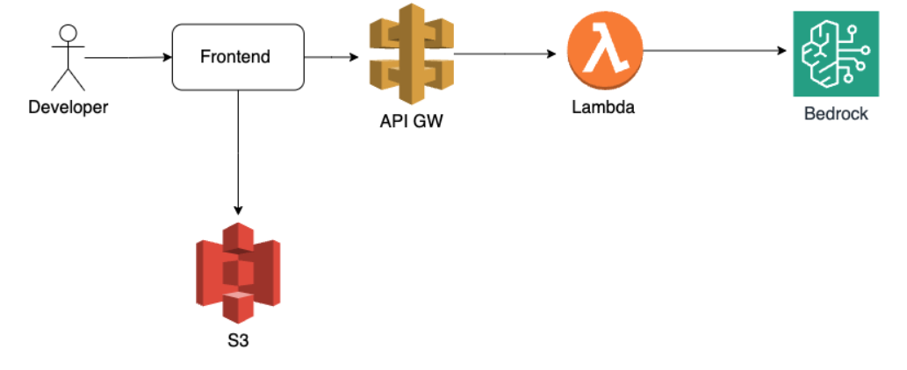
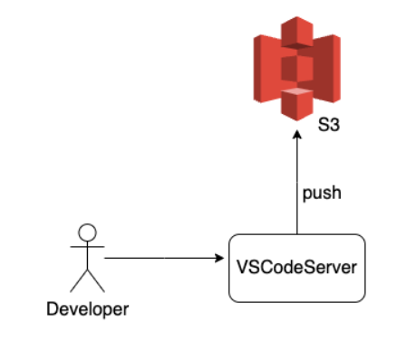
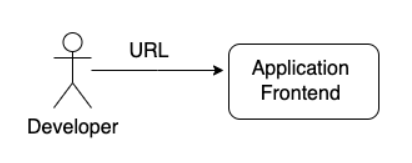
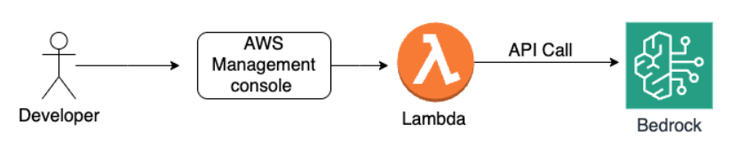
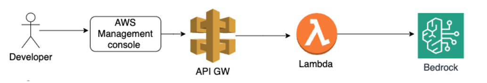
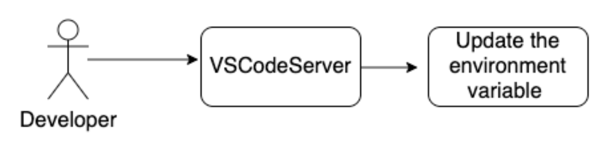
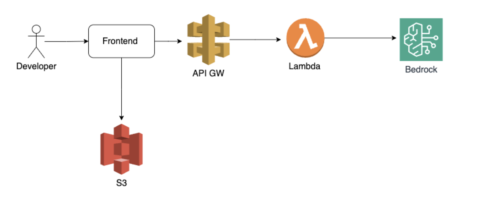

# Integrating Amazon Bedrock FMs Into an Application

## Lab overview

In this lab, you will create a backend for a flash card application. Through this lab, you will gain hands-on experience in building a serverless backend, integrating a large language model (LLM) service, and connecting it to a frontend application, enabling seamless communication between the different layers of a modern web application.

### Objectives

By the end of this lab, you should be able to do the following:

* Build an AWS Lambda function to invoke the Amazon Bedrock LLM service and generate flash cards from study notes in a JSON format suitable for the frontend.
* Create an API Gateway REST API with a gateway proxy method and configure CORS settings to enable communication between the frontend and backend.
* Integrate the frontend application with the backend by updating the API endpoint URL in the frontend source code.
* Test the end-to-end application by submitting study notes and verifying the generated flash cards, gaining practical experience in building a serverless backend with an LLM service and connecting it to a frontend application.

## Start lab

To launch the lab, at the top of the page, choose **Start Lab**.

**Caution:** You must wait for the provisioned AWS services to be ready before you can continue.

To open the lab, choose **Open Console**.

You are automatically signed in to the AWS Management Console in a new web browser tab.

**Warning:** Do not change the Region unless instructed.

### Lab environment

The architecture diagram illustrates the workflow of an application involving a developer, frontend code, API Gateway, Lambda function, Amazon Bedrock service, and an Amazon Simple Storage Service (Amazon S3) bucket. The developer provides the frontend code, which is deployed to the S3 bucket configured for static website hosting. The frontend code communicates with the API Gateway, which invokes the Lambda function. The Lambda function interacts with the Amazon Bedrock service to generate flash cards content based on the input provided by the frontend code.

#### The following diagram shows the basic architecture of the lab environment



* The **frontend cod**e is stored on an Amazon Elastic Compute Cloud (Amazon EC2) instance provisioned by an AWS CloudFormation template. You will access this code through a **Visual Studio Code server** running on the EC2 instance.
* An **Amazon S3 bucket** is also pre-provisioned by the CloudFormation template, and it is configured for static website hosting. You will deploy the built version of the frontend application to this S3 bucket.
* During the lab, you will create, configure, and deploy the remaining AWS services, including the following:

  * **AWS Lambda** function to invoke the **Amazon Bedrock LLM** service and generate flash cards content from the provided study notes.
  * **Amazon API Gateway REST API** with a gateway proxy method to connect the frontend application to the Lambda function, enabling communication between the frontend and backend.

### Services used in this lab

**AWS Lambda**
AWS Lambda is a serverless compute service that runs code in response to events or requests, without the need to manage servers.

**Amazon API Gateway**
Amazon API Gateway is a fully managed service that makes it easy for developers to create, publish, maintain, monitor, and secure APIs at any scale.

**Amazon Bedrock**
Amazon Bedrock is a service that hosts state-of-the-art LLMs and makes them accessible through APIs.

## Task 1: Set up and launch the frontend application

In this task, you will set up the frontend application by launching Visual Studio Code, installing the required dependencies, building the React application, and deploying it to an Amazon S3 bucket configured for static website hosting.



You will then launch the frontend application and attempt to generate flash cards from sample study notes, which will reveal the missing backend integration that needs to be addressed in subsequent tasks.



### Task 1.1: Set up and build the React application

The frontend application is built using the React library, which is a popular JavaScript library for creating UIs. React allows developers to build reusable UI components, and efficiently update and render them when data changes. The frontend code in this application is written using a combination of React, JavaScript, and HTML.

Before deploying the React application, you must install the required dependencies and build the application. The installation of dependencies is done using the `npm i` command, which reads the `package.json` file and installs all the necessary packages listed there. The `npm run build` command compiles and bundles the React code into optimized files ready for deployment in a web browser. The source code for the React application is already present in the Visual Studio Code editor, and you will compile and build it in the following steps.

To launch Visual Studio Code, retrieve the `VSCodeServerURL` link in the left navigation pane and paste it into a new browser tab.

When prompted, enter the password from the `Password` listed to the left of these instructions.

**Expected output:** When launching Visual Studio Code in the lab environment, the frontend-ui code is preconfigured as part of the lab install. You can see the folders in the explorer panel of Visual Studio Code. The frontend-ui directory contains the source code for the React application, including components, and other required files.

**Command:** To navigate to the `frontend-ui` directory, run the following command in the terminal.

```sh
cd frontend-ui/
```

**Expected output:** None unless there is an error

**Command:** To install the React application in the Amazon S3 bucket, run the following commands.

```sh
npm i
```

**Expected output**

```plaintext
************************
**** EXAMPLE OUTPUT ****
************************

npm WARN deprecated @babel/plugin-proposal-optional-chaining@7.21.0: This proposal has been merged to the ECMAScript standard and thus this plugin is no longer maintained. Please use @babel/plugin-transform-optional-chaining instead.
npm WARN deprecated rollup-plugin-terser@7.0.2: This package has been deprecated and is no longer maintained. Please use @rollup/plugin-terser
npm WARN deprecated rimraf@3.0.2: Rimraf versions prior to v4 are no longer supported
npm WARN deprecated sourcemap-codec@1.4.8: Please use @jridgewell/sourcemap-codec instead
npm WARN deprecated @babel/plugin-proposal-numeric-separator@7.18.6: This proposal has been merged to the ECMAScript standard and thus this plugin is no longer maintained. Please use @babel/plugin-transform-numeric-separator instead.
npm WARN deprecated @humanwhocodes/config-array@0.11.14: Use @eslint/config-array instead
npm WARN deprecated @babel/plugin-proposal-nullish-coalescing-operator@7.18.6: This proposal has been merged to the ECMAScript standard and thus this plugin is no longer maintained. Please use @babel/plugin-transform-nullish-coalescing-operator instead.
npm WARN deprecated @babel/plugin-proposal-class-properties@7.18.6: This proposal has been merged to the ECMAScript standard and thus this plugin is no longer maintained. Please use @babel/plugin-transform-class-properties instead.
npm WARN deprecated domexception@2.0.1: Use your platform's native DOMException instead
npm WARN deprecated glob@7.2.3: Glob versions prior to v9 are no longer supported
npm WARN deprecated stable@0.1.8: Modern JS already guarantees Array#sort() is a stable sort, so this library is deprecated. See the compatibility table on MDN: https://developer.mozilla.org/en-US/docs/Web/JavaScript/Reference/Global_Objects/Array/sort#browser_compatibility
npm WARN deprecated abab@2.0.6: Use your platform's native atob() and btoa() methods instead
npm WARN deprecated inflight@1.0.6: This module is not supported, and leaks memory. Do not use it. Check out lru-cache if you want a good and tested way to coalesce async requests by a key value, which is much more comprehensive and powerful.
npm WARN deprecated @babel/plugin-proposal-private-methods@7.18.6: This proposal has been merged to the ECMAScript standard and thus this plugin is no longer maintained. Please use @babel/plugin-transform-private-methods instead.
npm WARN deprecated w3c-hr-time@1.0.2: Use your platform's native performance.now() and performance.timeOrigin.
npm WARN deprecated @humanwhocodes/object-schema@2.0.3: Use @eslint/object-schema instead
npm WARN deprecated q@1.5.1: You or someone you depend on is using Q, the JavaScript Promise library that gave JavaScript developers strong feelings about promises. They can almost certainly migrate to the native JavaScript promise now. Thank you literally everyone for joining me in this bet against the odds. Be excellent to each other.
npm WARN deprecated 
npm WARN deprecated (For a CapTP with native promises, see @endo/eventual-send and @endo/captp)
npm WARN deprecated workbox-cacheable-response@6.6.0: workbox-background-sync@6.6.0
npm WARN deprecated workbox-google-analytics@6.6.0: It is not compatible with newer versions of GA starting with v4, as long as you are using GAv3 it should be ok, but the package is not longer being maintained
npm WARN deprecated svgo@1.3.2: This SVGO version is no longer supported. Upgrade to v2.x.x.

added 1547 packages, and audited 1548 packages in 37s

261 packages are looking for funding
run `npm fund` for details

11 vulnerabilities (4 moderate, 7 high)

To address issues that do not require attention, run:
npm audit fix

To address all issues (including breaking changes), run:
npm audit fix --force

Run `npm audit` for details.
npm notice 
npm notice New major version of npm available! 9.8.0 -> 10.8.2
npm notice Changelog: https://github.com/npm/cli/releases/tag/v10.8.2
npm notice Run npm install -g npm@10.8.2 to update!
npm notice
```

**Note:** The output shows some vulnerabilities and deprecated packages that would typically be addressed in a production-grade environment. However, for the purpose of this lab, you will continue forward with the learning objectives and ignore these issues.

**Command:** To build the React application, which involves compiling and packaging the React code into optimized files ready for deployment in a browser, run the following command.

```sh
npm run build
```

**Expected output**

```plaintext
************************
**** EXAMPLE OUTPUT ****
************************

> frontend-ui@0.1.0 build
> react-scripts build

Creating an optimized production build...
Compiled successfully.

File sizes after gzip:

59.9 kB  build/static/js/main.e2dfdbdf.js
1.78 kB  build/static/js/453.35a94a36.chunk.js
683 B    build/static/css/main.effe9c71.css

The project was built assuming it is hosted at /.
You can control this with the homepage field in your package.json.

The build folder is ready to be deployed.
You may serve it with a static server:

npm install -g serve
serve -s build

Find out more about deployment here:

https://cra.link/deployment
```

### Task 1.2: Deploy the React application to Amazon S3

Now, you will deploy the React application to Amazon S3.

**Command:** To deploy and synchronize the build files with the pre-provisioned S3 bucket configured to host a static webpage, run the following command, replacing `INSERT_S3_BUCKET_NAME` placeholder value with the `S3BucketName` value listed to the left of these instructions.

**Note:** In the upcoming steps, you might encounter a prompt from your web browser requesting permission for `*.cloudfront.net` to see text and images copied to the clipboard. This permission is required for the lab environment to function correctly. To allow the requested permission, choose `Allow` or `Grant` when prompted.

**Copy edit**

```sh
aws s3 sync build/ s3://INSERT_S3_BUCKET_NAME
```

**Expected output**

```plaintext
************************
**** EXAMPLE OUTPUT ****
************************

upload: build/favicon.ico to s3://sample-bucket-us-east-1-oa7uzf1voq5a/favicon.ico   
upload: build/logo512.png to s3://sample-bucket-us-east-1-oa7uzf1voq5a/logo512.png   
upload: build/asset-manifest.json to s3://sample-bucket-us-east-1-oa7uzf1voq5a/asset-manifest.json
upload: build/logo192.png to s3://sample-bucket-us-east-1-oa7uzf1voq5a/logo192.png
upload: build/static/js/main.e8bc473d.js.LICENSE.txt to s3://sample-bucket-us-east-1-oa7uzf1voq5a/static/js/main.e8bc473d.js.LICENSE.txt
upload: build/manifest.json to s3://sample-bucket-us-east-1-oa7uzf1voq5a/manifest.json
upload: build/robots.txt to s3://sample-bucket-us-east-1-oa7uzf1voq5a/robots.txt
upload: build/index.html to s3://sample-bucket-us-east-1-oa7uzf1voq5a/index.html
upload: build/static/css/main.effe9c71.css to s3://sample-bucket-us-east-1-oa7uzf1voq5a/static/css/main.effe9c71.css
upload: build/static/css/main.effe9c71.css.map to s3://sample-bucket-us-east-1-oa7uzf1voq5a/static/css/main.effe9c71.css.map
upload: build/static/js/453.35a94a36.chunk.js.map to s3://sample-bucket-us-east-1-oa7uzf1voq5a/static/js/453.35a94a36.chunk.js.map
upload: build/static/js/453.35a94a36.chunk.js to s3://sample-bucket-us-east-1-oa7uzf1voq5a/static/js/453.35a94a36.chunk.js
upload: build/static/js/main.e8bc473d.js.map to s3://sample-bucket-us-east-1-oa7uzf1voq5a/static/js/main.e8bc473d.js.map
upload: build/static/js/main.e8bc473d.js to s3://sample-bucket-us-east-1-oa7uzf1voq5a/static/js/main.e8bc473d.js
```

### Task 1.3: Launch and test the frontend application

In this task, you will launch and test the frontend application.

To launch the application, choose the `WebsiteURL` link located in the left navigation pane and paste it into a new browser tab.

**Expected output**

The frontend application should launch in the new browser tab, displaying the user interface of the React application. You should see the input field where you can enter study notes, as well as any other UI components related to the flash card generation and display.

In the `Drop your study notes here` field, paste the following sample study notes.

```plaintext
Houston is a large metropolis in Texas, extending to Galveston Bay. It's closely linked with the Space Center Houston, the coastal visitor center at NASA's astronaut training and flight control complex. The city's relatively compact downtown includes the Theater District, home to the renowned Houston Grand Opera, and the Historic District, with 19th-century architecture and upscale restaurants.
```

After entering the study notes, choose `Generate Flashcards` to initiate the flash card generation process.

**Expected output:** The application will return an API Gateway endpoint not found error message and set the endpoint in the environment variable of the source code.

**Note:** This output is expected because you have not yet integrated the frontend application with the backend API Gateway. The `REACT_APP_API_GATEWAY_ENDPOINT_URL` environment variable is available in the `.env` file of the frontend application, and you will update it with the appropriate API Gateway Invoke URL in the upcoming tasks. Once the integration is complete, the frontend application will be able to communicate with the backend API Gateway and invoke the Lambda function to generate flash cards from the provided study notes.

**Task complete:** You successfully set up the frontend web application and identified the missing backend integration, which you will address in the upcoming tasks.

## Task 2: Request Amazon Bedrock model access

In this task, you will request access to the Nova Lite model used in this lab.

At the top of the AWS Management Console, in the search bar, search for and choose `Amazon Bedrock`.

At the top of the AWS Management Console, ensure that the Region is the same as referenced in the panel to the left of the instructions.

Expand the left navigation menu by choosing the three parallel horizontal lines.

Scroll down to `Bedrock configurations` and choose `Model access`.

In the `What is Model access?` section, choose `Enable specific models`.

Under `Amazon`, select `Nova Lite`.

**Caution:** Requesting access to any models other than those listed in this task might result in an error and prevent you from completing this lab.

Choose `Next`.

Choose `Submit`.

Once the request succeeds, Amazon Bedrock changes the `Access status` to `Access granted` for the requested model.

**Task complete:** You successfully gained access to the Nova Lite model. You will use this model in the following task by creating a Lambda function that has integration code.

## Task 3: Create a Lambda function to generate flash cards

To understand the components involved in this task, examine the following architecture diagram.



This diagram illustrates the AWS Lambda function, created via the AWS Management Console, invoking the Amazon Bedrock LLM service to generate flash cards from study notes.

In this task, you will build an AWS Lambda function that invokes the Amazon Bedrock LLM service to generate flash cards from study notes in a JSON format suitable for the frontend application. The AWS Lambda function will be created in the AWS Management Console.

### Task 3.1: Create a new AWS Lambda function

In this task, you will create a new Lambda function.

At the top of the AWS Management Console, in the search bar, search for and choose `Lambda`.

To create a new AWS Lambda function, choose `Create function`.

On the `Create function` page, configure the settings as follows:

* Select the `Author from scratch` option.
* For `Function name`, enter `GenerateFlashcards`.
* For `Runtime`, choose `Python 3.12`.
* Expand the `Change default execution role` section.
* Choose `Use an existing role`.
* On the `Existing role` menu, choose `BedrockLambdaRole`.

This IAM role has the necessary permissions to invoke the Amazon Bedrock LLM service.

Choose `Create function`.

If the Lambda function is performing complex tasks, such as generating flash cards content using AI, the process might take longer than 3 seconds to complete. Increasing the timeout ensures that the function has enough time to finish its work without being prematurely terminated.

On the `Configuration` tab, choose `Edit`.

On the `Basic settings` page, for `Timeout`, enter `1 min 0 sec`.

Choose `Save`.

### Task 3.2: Add Lambda function code

You will now add the Lambda function code.

Choose the `Code` tab.

Replace the existing code by copying and pasting the provided Python code into the code editor.

```python
import boto3  # Import the boto3 library for AWS services
import json  # Import the json library for working with JSON data
from botocore.exceptions import ClientError  # Import the ClientError exception from botocore


def format_body(system_prompt, user_prompt):
    # Format the request payload using Nova model's native structure
    native_request = {
        "messages": [
            {
                "role": "user",
                "content": [{"text": f"{system_prompt}\n\n*Study Notes*: {user_prompt}"}]
            }
        ],
        "inferenceConfig": {
            "maxTokens": 512,
            "temperature": 0.8,
            "topP": 0.9
        }
    }
    
    # Convert the native request to JSON
    body = json.dumps(native_request)
    
    return body


def invoke_bedrock(model_id, body):
    # Create a Bedrock Runtime client in the AWS Region of your choice.
    client = boto3.client("bedrock-runtime")
    try:
        # Invoke the model with the request.
        response = client.invoke_model(modelId=model_id, body=body)

    except (ClientError, Exception) as e:
        # Handle exceptions when invoking the model
        print(f"ERROR: Can't invoke '{model_id}'. Reason: {e}")
        exit(1)
    
    # Decode the response body from the model.
    model_response = json.loads(response["body"].read())
        
    return model_response
    

def lambda_handler(event, context):
    # Set the model ID for Amazon Nova Lite foundation model
    model_id = "amazon.nova-lite-v1:0"

    # Get the study notes from the event payload
    user_prompt = event['notes']

    # Define the system prompt for the model
    system_prompt = """You are an AI that generates flash cards from study notes. When provided with *Study Notes*, you will produce an array of objects where each object represents a flash card. Each flash card object must have a "front" property containing the question and a "back" property containing the answer. The output should be an array with three flash card objects. Do not include anything else other than the array of flash cards. Your response should ONLY contain the array of objects in the following format:
[ {"front": "question here", "back": "answer here"},
{"front": "question here", "back": "answer here"},
{"front": "question here", "back": "answer here"} ]"""

    # Format the model-specific request body
    body = format_body(system_prompt, user_prompt)

    # Invoke the Bedrock model with the formatted request body
    response = invoke_bedrock(model_id, body)
    
    # Print the model's response
    print(response)
    
    # Extract the response text from Nova's response structure
    response_text = response["output"]["message"]["content"][0]["text"]
    
    # Return the response in the format expected by the frontend (Titan format)
    return {
        'statusCode': 200,
        'headers': {
            'Access-Control-Allow-Origin': '*',  # Allow cross-origin requests
            'Access-Control-Allow-Methods': 'OPTIONS,POST,GET',
            'Access-Control-Allow-Headers': 'Content-Type,X-Amz-Date,Authorization,X-Api-Key,X-Amz-Security-Token'
        },
        'body': json.dumps({
            'results': [
                {
                    'outputText': response_text
                }
            ]
        })
    }
```

Here’s a brief description of each part of the code.

Imports: The necessary libraries for working with AWS services, JSON data, timestamps, and handling exceptions are imported.

format_body: This function formats the prompt for the model by combining the system instructions, a random seed or timestamp, and the user-provided study notes. It then creates a request dictionary with the formatted prompt and generation parameters, like maximum length, temperature, and Top P. Finally, it converts the request to JSON and returns it.

invoke_bedrock: This function creates an Amazon Bedrock runtime client and invokes the specified model with the provided request body. It handles any exceptions that might occur during the invocation and decodes the response body from the model.

lambda_handler: This is the entry point for the Lambda function. It sets the model ID, retrieves the study notes from the event payload, and defines the system prompt for the model. It then calls the format_body function to create the request body and the invoke_bedrock function to invoke the model with the formatted request body. Finally, it prints the model’s response and returns it as the Lambda function’s output, with appropriate headers to allow cross-origin requests.

 Note: The provided code includes CORS headers to allow cross-origin requests from the frontend application.

Task 3.3: Configure test event
You will now configure a test event.

Choose the Test tab.

Configure the Test event settings as follows:

For Test event action, choose Create new event.

For Event name, enter Test.

For Event sharing settings, choose Private.

In Event JSON, replace the existing code with the following JSON payload.

 Note: You will pass exactly the same text that you used earlier as part of the payload input.

{
"notes": "Houston is a large metropolis in Texas, extending to Galveston Bay. It’s closely linked with the Space Center Houston, the coastal visitor center at NASA’s astronaut training and flight control complex. The city’s relatively compact downtown includes the Theater District, home to the renowned Houston Grand Opera, and the Historic District, with 19th-century architecture and upscale restaurants."
}
In the Test event section, choose Save.

Task 3.4: Test and validate the Lambda function
In this task, you will test and validate the Lambda function.

Choose the Code tab.

In the Code source section, choose Deploy.

To invoke the AWS Lambda function with the Test event, choose Test.

Choose the Execution result tab generated during the test, and then examine the output.

Explanation of the test output
Response
statusCode: 200: This means that the Lambda function executed successfully without any errors.
headers: These allow the response to be accessed from any webpage (Access-Control-Allow-Origin: "") and define which HTTP methods (OPTIONS, POST, GET) and headers are allowed.
body: The actual content returned by the Lambda function. In this case, it’s a JSON string containing the AI-generated flash cards. The outputText field includes the flash cards in the requested format.
Function Logs
START and END: These indicate the beginning and end of the Lambda function’s execution.
REPORT: Provides detailed performance metrics, including the following:
Duration: The time the function took to run.
Billed Duration: AWS bills you for the time your function ran, rounded up to the nearest 100 milliseconds.
Memory Size: The amount of memory allocated to your Lambda function.
Max Memory Used: The peak memory usage during the function’s execution.
Summary
The test output shows that your Lambda function executed successfully, and generated the desired flash cards. The memory usage was within limits, and the response includes the flash cards, as expected.
Confirm that the generated flash cards accurately represent the provided study notes.

 Task complete: You successfully built an AWS Lambda function that invokes the Amazon Bedrock LLM service and generates flash cards from study notes in a JSON format suitable for the frontend application. The next step is to create an API Gateway to make the Lambda function accessible.

## Task 4: Create an API Gateway REST API with a gateway proxy method

To understand the components involved in this task, examine the following architecture diagram.



This diagram highlights the API Gateway REST API with a gateway proxy method, enabling communication between the frontend application and the AWS Lambda function, while the configured CORS settings allow cross-origin requests from the frontend application.

In this task, you will create an API Gateway REST API with a gateway proxy method to enable communication between the frontend application and the AWS Lambda function. You will also configure CORS settings to allow cross-origin requests from the frontend application.

Task 4.1: Create a new API Gateway REST API
First, you must create a new API Gateway REST API.

At the top of the AWS Management Console, in the search bar, search for and choose API Gateway.

In the API Gateway welcome page, scroll to the API types section and choose Create REST API.

In the Create REST API window, configure the following settings:

Verify that New API is chosen.
For API name, enter BedrockLambdaAPI.
For API endpoint type, ensure that Regional is selected.
Choose Create API.

Task 4.2: Create a resource and method
In this task, you will create a resource and method.

In the Resources page, choose Create resource and configure the settings as follows:

For Resource path, verify that it is /.
For Resource name, enter bedrocklambda.
Choose Create resource.

With the /bedrocklambda resource selected, choose Create method and configure the settings as follows:

On the Method type menu, choose POST.

For Integration type, verify that Lambda function is selected.

For Lambda function, choose the Region to match the Region referenced in the panel to the left of the instructions.

Choose the AWS Lambda function ARN corresponding to the GenerateFlashcards function on the menu.

 Note: When you create the POST method for this resource, you set up a gateway proxy method integration with the Lambda function. This integration type allows the API Gateway to act as a proxy and forward incoming requests directly to the integrated Lambda function.

Scroll down to the Request body section, expand it, and configure the following settings:

Choose Add model.
For Content type, enter application/json.
For Model, choose Empty.
Choose Create method.

Task 4.3: Test the POST method
In this task, you will test the POST method.

With the POST method selected, choose the Test tab.

Enter the following JSON payload in the Request Body section:


        {
    "notes": "Houston is a large metropolis in Texas, extending to Galveston Bay. It’s closely linked with the Space Center Houston, the coastal visitor center at NASA’s astronaut training and flight control complex. The city’s relatively compact downtown includes the Theater District, home to the renowned Houston Grand Opera, and the Historic District, with 19th-century architecture and upscale restaurants." 
    }
Choose Test.

After making the test call with the provided JSON payload, the output will show the test results for the /bedrocklambda1 - POST method. Pay attention to the following details in the output.

The Response body section contains the response from the AWS Lambda function, which includes the generated flash cards in the expected JSON format. This is the most important part to verify, as it confirms that the API Gateway is correctly invoking the AWS Lambda function and receiving the expected output.

 Note: In the first test, the actual Response body might not match the expected JSON format described in the instructions. This can happen due to the asynchronous nature of the AWS Lambda function invocation. If this occurs, simply rerun the test, and you should receive the expected response body containing the generated flash cards in the correct JSON format.

The Status field should show 200, indicating a successful response.

The Latency ms field shows the total latency for the request, which can be useful for monitoring performance.

The Logs section provides detailed information about the request and response processing, including the request body, endpoint request URI, headers, and any transformation applied to the request or response. This can be helpful for debugging purposes.

If the response body contains the expected flash cards in the correct JSON format, and the status code is 200, it indicates that the API Gateway and AWS Lambda function integration is working correctly.

Task 4.4: Enable CORS
In a web application environment, where the frontend and backend are hosted on different domains or origins, the browser’s security mechanism known as the Same-Origin Policy prevents the frontend from making requests to the backend API due to the cross-origin restriction. This restriction is in place to prevent malicious websites from making unauthorized requests to other domains.

However, in this lab application architecture, the frontend React application hosted on an S3 bucket must communicate with the API Gateway, which is hosted on a different domain. To overcome this restriction and allow the frontend to make requests to the backend API, we need to enable CORS on the API Gateway.

CORS is a mechanism that allows web servers to specify which origins (domains) are permitted to access their resources. By enabling CORS on the API Gateway, we can explicitly allow the frontend application hosted on the S3 bucket to make requests to the API Gateway.

If we do not enable CORS, the browser will block the frontend application’s requests to the API Gateway due to the Same-Origin Policy, preventing the successful integration between the frontend and backend. This will result in the frontend application being unable to invoke the Lambda function through the API Gateway to generate the flash cards content.

Choose /bedrocklambda method, and then choose Enable CORS.

In the CORS setting page, for Access-Control-Allow-Methods, select POST.

Choose Save.

When you choose Enable CORS, the OPTIONS method is automatically enabled because it is a fundamental part of the CORS protocol.

 Learn more: Refer to the Additional resource section for more information.

Task 4.5: Deploy the API and obtain the Invoke URL
In this task, you will deploy the API and get the Invoke URL.

Choose Deploy API.

In the Deploy API window, on the Deployment stage menu, choose New Stage.

For Stage name, enter Demo.

Choose Deploy.

Expand the Demo stage, till the OPTIONS or POST method.

Copy the Invoke URL and save it in a text editor. This URL will be used to integrate the frontend application with the backend API Gateway.

Task complete: You successfully created an API Gateway REST API with a gateway proxy method for communication with an AWS Lambda function, configured CORS settings, deployed the API to a Demo stage, and noted the endpoint URL for integration with the frontend application. In the next task, you will integrate the generated API Gateway URL with the frontend application.

---

```sh
https://h3agn8212m.execute-api.us-east-1.amazonaws.com/Demo/bedrocklambda
```

## Task 5: Integrate the frontend application with the backend

To understand the components involved in this task, examine the following architecture diagram.



This diagram illustrates the integration of the frontend application with the backend by updating the API endpoint URL in the frontend source code, enabling communication with the API Gateway and invoking the AWS Lambda function created previously.

In this task, you will integrate the frontend application with the backend by updating the API endpoint URL in the frontend source code. This will allow the frontend application to communicate with the API Gateway and invoke the AWS Lambda function that you created earlier.

Task 5.1: Update the API Gateway endpoint URL
In this task, you will update the API Gateway endpoint URL.

Navigate to the Visual Studio Code tab.

Navigate to the frontend-ui directory where the React application source code is located.

In the root directory of the frontend-ui directory, locate the .env file.

Open the .env file in Visual Studio Code.

Find the REACT_APP_API_GATEWAY_ENDPOINT_URL environment variable.

Paste the Invoke URL endpoint you copied earlier as a value for REACT_APP_API_GATEWAY_ENDPOINT_URL environment variable.

 Note: The REACT_APP_API_GATEWAY_ENDPOINT_URL should look like this: REACT_APP_API_GATEWAY_ENDPOINT_URL=https://vyp5w1bl3m.execute-api.us-west-2.amazonaws.com/Demo/bedrocklambda.

Save the .env file after making the necessary changes.

 Note: The React application will automatically pick up the updated environment variable during the build process.

Close the .env file.

Task 5.2: Build and deploy the updated frontend application
Now, you will build and deploy the updated frontend application.

 Command: To build the React application, run the following command.


npm run build
 Command: To synchronize the build files with the pre-provisioned S3 bucket, run the following command, replacing the INSERT_S3_BUCKET_NAME placeholder value with the S3BucketName value listed to the left of these instructions.

 Copy edit


aws s3 sync build/ s3://INSERT_S3_BUCKET_NAME
 Task complete: You successfully integrated the frontend application with the backend by updating the API endpoint URL in the frontend source code.

## Task 6: Test the end-to-end application

To understand the components involved in this task, examine the following architecture diagram.



The diagram depicts the end-to-end architecture of the index card app, illustrating the flow of data and communication between the frontend, backend services (API Gateway, Lambda, and Amazon Bedrock LLM), and the static website hosting on Amazon S3.

In this task, you will test the end-to-end application by submitting study notes through the frontend and verifying that the generated flash cards are displayed correctly. This will allow you to gain practical experience in building a serverless backend with an LLM service and connecting it to a frontend application.

Navigate to the browser tab where the React app is open.

Refresh the browser.

Paste the following sample study notes into the Drop your study notes here input field.


Houston is a large metropolis in Texas, extending to Galveston Bay. It's closely linked with the Space Center Houston, the coastal visitor center at NASA's astronaut training and flight control complex. The city's relatively compact downtown includes the Theater District, home to the renowned Houston Grand Opera, and the Historic District, with 19th-century architecture and upscale restaurants.
After entering the study notes, choose Generate Flashcards to initiate the flash card generation process.

Interact with the generated flash cards by flipping or toggling between the front and back sides to test the functionality.

Verify that the frontend application displays the generated flash cards correctly, with each flash card showing a question on the front side and an answer on the back side.

If desired, repeat the steps with different study notes or text passages to further test the application’s functionality (optional).

 Task complete: You successfully tested the end-to-end application, gaining practical experience in building a serverless backend with an LLM service and connecting it to a frontend application.

Conclusion
 Congratulations! You successfully completed the following tasks:

Built an AWS Lambda function to invoke the Amazon Bedrock LLM service and generate flash cards from study notes in a JSON format suitable for the frontend.
Created an API Gateway REST API with a gateway proxy method and configured CORS settings to enable communication between the frontend and backend.
Integrated the frontend application with the backend by updating the API endpoint URL in the frontend source code.
Tested the end-to-end application by submitting study notes and verifying the generated flash cards, gaining practical experience in building a serverless backend with an LLM service and connecting it to a frontend application.
End lab

## Follow these steps to close the console and end your lab

Return to the AWS Management Console.

At the upper-right corner of the page, choose AWSLabsUser, and then choose Sign out.

Choose End Lab and then confirm that you want to end your lab.

## Additional Resource

* [Amazon Simple Storage Service User Guide: Using cross-origin resource sharing (CORS)](https://docs.aws.amazon.com/AmazonS3/latest/userguide/cors.html)
* [React MIT License](https://github.com/facebook/react?tab=MIT-1-ov-file#readme)

JavaScript is property of Oracle Corporation, Python is property of the Python Software Foundation (PSF), React is property of Meta Platforms, Inc., and Visual Studio Code is property of Microsoft. Reference in this lab to any specific commercial product, process, or service, or the use of any trade, firm or corporation name is provided for informational purposes, and does not constitute endorsement, recommendation, or favoring by Amazon Web Services.
