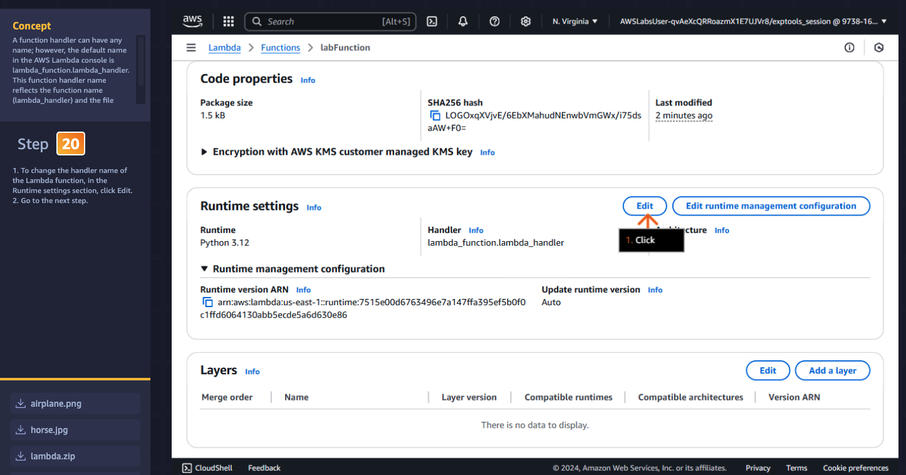
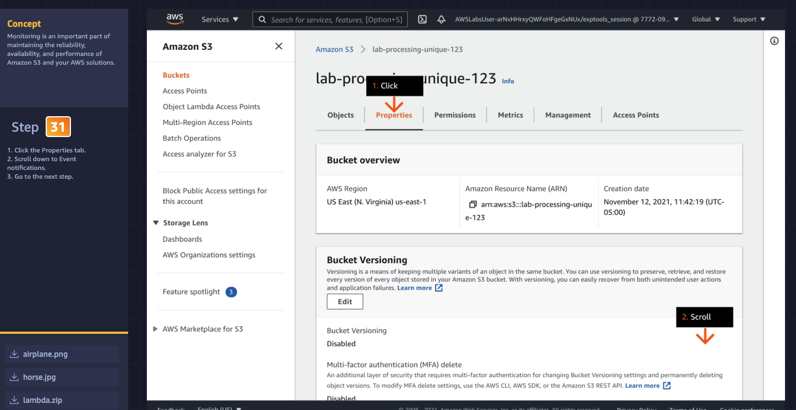
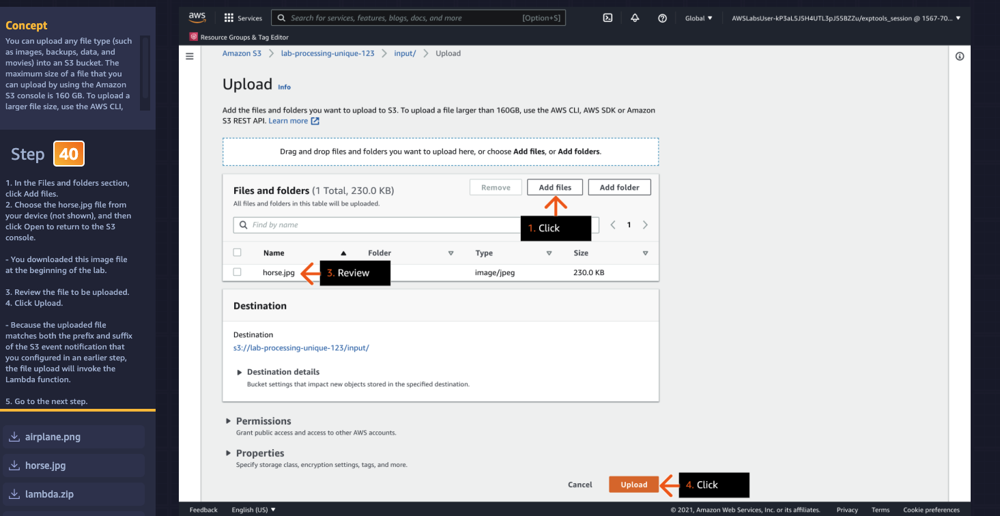
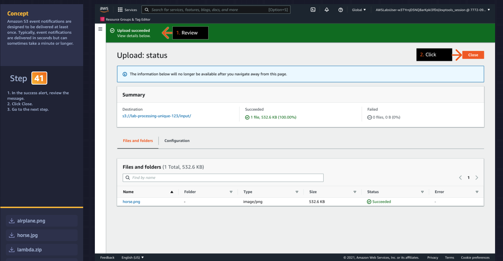

# Week 7: AWS SimuLearn: Image and Video Analysis

* back to AWS Cloud Institute repo's root [aci.md](../aci.md)
* back to [AWS Cloud Operations 2](../ai-for-developers.md)
* back to repo's main [README.md](../../../../README.md)

## Description

## Overview

## Learn

1. 
2. 
3. 
4. 
5. 
6. 
7. 
8. 
9. 

## Practice

1. 
2. 
3. 
4. 
5. 
6. 
7. 
8. 
9. 
10. 
11. 
12. 
13. 
14. 
15. 
16. 
17. 
18. 
19. 
20. 
21. 
22. 
23. 
24. 
25. 
26. 
27. 
28. 
29. 
30. 
31. 
32. 
33. 
34. 
35. 
36. 
37. 
38. 
39. 
40. 
41. 
42. 
43. 
44. 
45. 
46. 
47. 
48. 
49. 

## DIY

1. 
2. 
3. 
