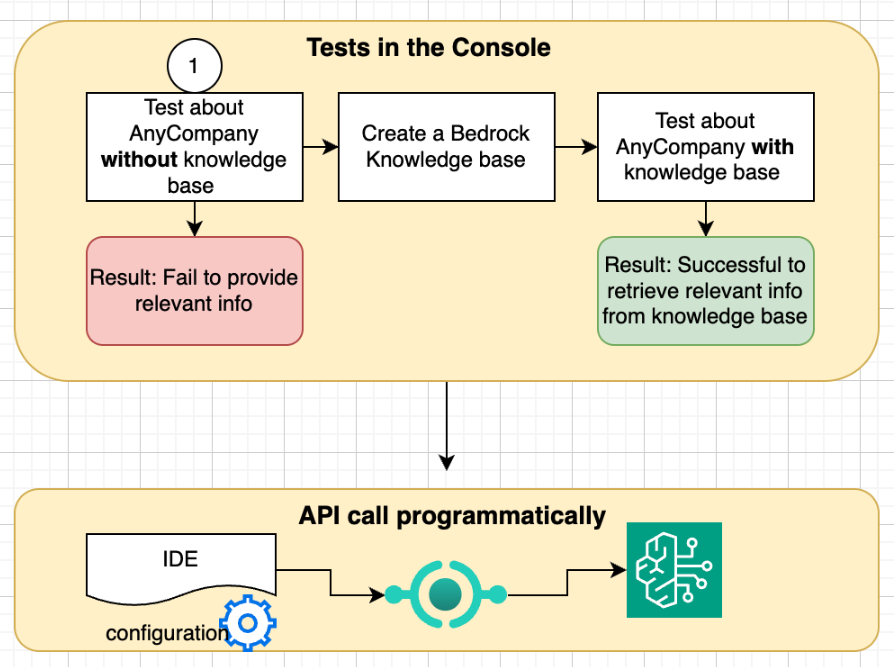

# Week 8: Performing RAG with Knowledge Bases for Amazon Bedrock

## Lab overview

Amazon Bedrock knowledge bases allow you to provide foundation models (FMs) with proprietary information or information that is more up to date than when the FM was trained. Knowledge bases implements Retrieval Augmented Generation (RAG), a technique that fetches data from company data sources to enrich the prompt to provide more relevant, context-specific, and accurate responses. They allow you implement the RAG workflow without having to build custom integrations to data sources or manage the data flow.

In this lab you will create and test an Amazon Bedrock knowledge base.

Scenario
In this lab, you will play the role of an AI specialist working for AnyCompany consumer electronics, a fictional company. The company is impressed with the work you have completed since hiring you. Of course, with great success comes higher expectations and they now have a new challenge for you.

The VP of the Customer Service organization approached your manager to see if she could utilize your talents. The customer service team has a collection of internal documents including text files and CSV files that contain information to help team members perform their jobs and gain an understanding of how well they are hitting their business goals. The VP would like you to create a proof of concept (POC) chat app for the customer service employees. The chat app should leverage an LLM, but also be aware of the information in these internal documents and thus be able to respond to prompts with relevant information, some of which is only documented within the AnyCompany organization.

To create the POC, you decide to create a Bedrock knowledge base. This will allow you to accomplish Retrieval Augmented Generation (RAG) without needing to code. Responses generated by an LLM will be augmented with information from the knowledge base. You start with the AWS Management console to test the POC and after successful testing, you access the knowledge base through API.

Image description: The image depicts a high level view of the lab flow and POC. User will test in the AWS Management Console an LLM about AnyCompany without the use of a knowledge base only to fail in receiving relevant information. After creating the knowledge base, the user will run the tests again and receive relevant responses retrieve from information in the knowledge base. The user will then access the knowledge base programmatically through an API call.

Objectives
By the end of this lab, you should be able to do the following:

Add source documents for an Amazon Bedrock knowledge base to an Amazon S3 bucket.
Create a Bedrock knowledge base.
Use the Bedrock console test panel feature to test the knowledge base.
Recognize how responses are enriched by the context that is received from querying the knowledge base.
Use the RetrieveAndGenerate API to query the knowledge base and generate responses from the information it retrieves.
Icon key
Various icons are used throughout this lab to call attention to different types of instructions and notes. The following list explains the purpose for each icon:

 Analysis: A detailed examination of a topic or concept to promote understanding.
 Caution: Information of special interest or importance (not so important to cause problems with the equipment or data if you miss it, but it could result in the need to repeat certain steps).
 Command: A command that you must run.
 Consider: A moment to pause to consider how you might apply a concept in your own environment or to initiate a conversation about the topic at hand.
 Expected output: A sample output that you can use to verify the output of a command or edited file.
 Hint: A hint to a question or challenge.
 Note: A hint, tip, or important guidance.
 Task complete: A conclusion or summary point in the lab.
 Warning: An action that is irreversible and could potentially impact the failure of a command or process (including warnings about configurations that cannot be changed after they are made).
Start lab
To launch the lab, at the top of the page, choose Start Lab.

 Caution: You must wait for the provisioned AWS services to be ready before you can continue.

To open the lab, choose Open Console .

You are automatically signed in to the AWS Management Console in a new web browser tab.

 Warning: Do not change the Region unless instructed.

Common sign-in errors
Error: Choosing Start Lab has no effect
In some cases, certain pop-up or script blocker web browser extensions might prevent the Start Lab button from working as intended. If you experience an issue starting the lab:

Add the lab domain name to your pop-up or script blocker’s allow list or turn it off.
Refresh the page and try again.
Lab environment
AWS services used in this lab
Amazon Bedrock
Amazon Bedrock is a fully managed service that offers a choice of high-performing foundation models (FMs) from leading AI companies through a single API. It provides a broad set of capabilities to build generative AI applications with security, privacy, and responsible AI.

Amazon Simple Storage Service (Amazon S3)
Amazon S3 is an object storage service that offers industry-leading scalability, data availability, security, and performance. It provides easy-to-use management features that allow you to organize, secure, and monitor your data.

Task 1: Access and configure the Visual Studio Code IDE
In this task, you will configure the integrated development environment (IDE) hosted on an Amazon EC2 instance.

Task 1.1: Connect to the IDE
From the panel to the left of the lab instructions, copy the LabWorkspaceURL value and paste it into a new browser tab.

A web page prompting you to enter a password appears.

Copy the LabWorkspacePassword value from the same panel, paste it in the Password field and choose Submit.

A Visual Studio Code development environment appears.

 Note: Prior experience with this IDE is not required.

Task 1.2 - Optional: Configure the IDE
In this optional task, you will enable Amazon Q developer in the IDE.

You can skip this or you can optionally return to this section and do this later if you decide in the lab that you want to use Amazon Q to help with any task.

For detailed instructions, expand the following Detailed instructions section.

Detailed instructions
In the Amazon Q panel, choose Use for Free and then choose Continue.

Choose Proceed To Browser.

When asked if “you want code-server to open the external website,” choose Open.

​  Note: If your browser prevents from opening the site URL, then Allow pop-ups.

​ The browser takes you to the Authorization requested page. Here you see the confirmation code to verify with what you saw in the previous step.

Choose Confirm and continue.
​ Now that you have authorized Amazon Q, it needs to be connected to an AWS Builder ID.

​  Caution: The steps to complete this part of the lab differ depending on whether or not you have an existing AWS Builder ID. Choose the instruction set that applies to you and then expand the corresponding menu to view the steps.

If you do not have an existing AWS Builder ID, follow the details in this step to create one.

Important: If you already have an AWS Builder ID skip this step.

On the Create AWS Builder ID page, configure:

For Your email address: Enter your email address.
Choose Next.
On the subsequent page, enter:
For Your name: Enter a name of your choice.
Choose Next.
On the Email verification page, configure:

For Verification code: Enter verification code sent to your email address.
Choose Verify.
On the Choose your password page, configure:

For Password: Enter a password of your choice.
For Confirm password: Re-enter the same password.
Choose Create AWS Builder ID.
If you have an AWS Builder ID, or if you just finished creating an AWS Builder ID, expand the following menu and complete the steps.

Choose Already have AWS Builder ID? Sign in.

On the Sign in with AWS Builder ID page, configure:

For Your email address: Enter your email address.
Choose Next.

On the Enter your password page, configure:
For Password: Enter Password.
Choose Sign In.
 Note: A message in the development environment displays: Confirm code ‘XXXX-XXXX’ in the login page opened in your web browser. Make sure the code matches on the web page.

On the Allow AWS IDE Extensions for VSCode to access your data? page, choose Allow access.

A message appears indicating that you have successfully authenticated and can return to your development environment.

 Expected output:

AWS IDE Extensions for VSCode can now access your data in Amazon Q Developer.

Close the browser tab you used to authenticate and return to VSCode IDE.

A greeting message from Amazon Q appears in the Amazon Q: Chat sidebar.

 Task complete: You have set up your development environment and enabled Amazon Q.

Close the Amazon Q Welcome tab.

Choose the Explorer icon on the left to see the list of files available to you in the IDE.
 Task complete: You successfully connected to the IDE.

Task 2: Create an S3 bucket and populate it with data
In this task, you create an S3 bucket and then add documents to it. This bucket will provide the source data for the Bedrock knowledge base you will create for the AnyCompany customer support team.

Task 2.1: Create the bucket
You will now create an Amazon S3 bucket to hold the knowledge base content.

 Command: To create an S3 bucket, run the following commands in the terminal panel of the IDE.

kbbucket=$(aws s3api create-bucket --bucket kbbucket-$RANDOM-$RANDOM --region us-east-1 | cut -d '"' -f4 | cut -d '/' -f2 |sed -n 2p)
echo "bucket: "$kbbucket
 Note: The first time you try to copy and paste something into the IDE, you may be prompted to allow the xxxx.cloudfront.net domain which hosts the IDE to see text and images copied to the clipboard. If you agree to this choose Allow.

 Expected output: The terminal lists the name of the S3 bucket.

************************
**** EXAMPLE OUTPUT ****
************************

bucket: kbbucket-XXXXX-XXXXX
Task 2.2: Upload objects
In this task, you upload documents to the bucket.

Open any of the CSV files or text files you see listed in the Explorer panel to observe what content they contain.

The documents contain information about AnyCompany products, locations and sales. They also contain customer satisfaction data, and for example, in the product_support_tickets.csv file there are details about the AnyCompany customer support team’s prior interactions with customers.

 Command: Upload AnyCompany’s support team documents by running the following commands.

cd ~/environment
for csv in $(ls *.csv); do aws s3 cp $csv s3://$kbbucket/; done 
for txt in $(ls *.txt); do aws s3 cp $txt s3://$kbbucket/; done
 Expected output:

************************
**** EXAMPLE OUTPUT ****
************************

upload: ./csat_data.csv to s3://kbbucket-XXXXX-XXXXX/csat_data.csv  
upload: ./cust-interaction-data.csv to s3://kbbucket-XXXXX-XXXXX/cust-interaction-data.csv
upload: ./product_support_tickets.csv to s3://kbbucket-XXXXX-XXXXX/product_support_tickets.csv
upload: ./sales_data.csv to s3://kbbucket-XXXXX-XXXXX/sales_data.csv
upload: ./anycompany-investor-doc.txt to s3://kbbucket-XXXXX-XXXXX/anycompany-investor-doc.txt
upload: ./anycompany-product-descriptions.txt to s3://kbbucket-XXXXX-XXXXX/anycompany-product-descriptions.txt
 Command: To verify documents are now in the bucket, run the following command.

aws s3 ls $kbbucket
 Expected output: The output of the command should list all of the documents you just uploaded. These documents will become part of the Bedrock knowledge base you will soon create.

************************
**** EXAMPLE OUTPUT ****
************************

2024-10-17 23:33:05       2434 anycompany-investor-doc.txt
2024-10-17 23:33:06       2882 anycompany-product-descriptions.txt
2024-10-17 23:32:58      24564 csat_data.csv
2024-10-17 23:33:00    1379754 cust-interaction-data.csv
2024-10-17 23:33:01     218129 product_support_tickets.csv
2024-10-17 23:33:03       5545 sales_data.csv
 Task complete: You successfully created an Amazon S3 bucket and uploaded documents to it.

Task 3: Enable LLMs and run a prompt
In this task you enable the embeddings model as well as another model that you will make use of when testing the knowledge base.

Task 3.1: Enable LLMs
Start by enabling two LLMs needed for this lab.

On the AWS Management Console, in the search box, search for and choose Amazon Bedrock.

In the left navigation pane, scroll down to Configure and learn and choose Model access.

Choose Enable specific models at the top of the screen.

Select the checkbox next to the following models that listed under the Amazon section:

Amazon Nova Lite
Titan Text Embeddings V2
Choose Next.

Choose Submit.

 Expected output: Once the request succeeds, Amazon Bedrock changes the Access status to  Access granted for the requested models.

 Task complete: You successfully enabled LLMs in the Bedrock console.

Task 3.2: Run a prompt
In this task, you run a test prompt typical of what the AnyCompany customer support team might want to ask in a chat session, to observe the response generated by an LLM not augmented by RAG.

In the Bedrock console, in the left navigation pane, under Test, choose Chat/text playground.

 Note: For the rest of this lab, you may ignore the Access denied banner if it appears, as the actions denied are not needed.

For Mode, choose Chat.

Choose Select model.

In the Select model popup:

For Category, choose Amazon.
For Model, choose Nova Lite.
For Throughput, choose On-demand.
Choose Apply.

In the prompt text box, run the following prompt:

What are some premium features of the smartphones sold as AnyCompany products?
 Task complete: You successfully ran a prompt in the chat playground using the Amazon Nova Lite.

Task 4: Create a Bedrock knowledge base
With Amazon Bedrock knowledge bases, FMs are provided with information from a company’s private data sources for RAG to deliver more relevant, accurate, and customized responses.

In this task, you will create a knowledge base, provide it with data from a S3 bucket, and run prompts to test the relevancy of the responses.

Task 4.1: Create a Bedrock knowledge base
In this task, you create a Bedrock knowledge base. In creating it, you specify the S3 bucket containing the data and embeddings model that you enabled earlier.

In the Bedrock console, in the left navigation pane, under Build, choose Knowledge bases.

Choose Create and then Knowledge Base with vector store.

In the Knowledge base details section:

For Knowledge base name, enter AnyCompanyCustomerSupport.
For Knowledge base description - optional, enter Knowledge base for AnyCompany customer support staff.
In the IAM permissions section:

For Runtime role, choose Use an existing service role.
For Choose an existing role or create a new one drop down, choose KBRole.
In the Choose data source section:

Choose Amazon S3
Choose Next.

On the Configure data source screen:

For S3 URI, choose Browse S3.
Select the kbbucket-XXXXX-XXXXX bucket you already created earlier and uploaded documents to.
Choose Choose.
Choose Next.
On the Configure data storage and processing screen:

For Embeddings model, choose Titan Text Embeddings v2.

For Vector database, choose Quick create a new vector store - Recommended.

For Vector store type, choose Amazon OpenSearch Serverless.

Notice in the description of the quick create option, it says that an Amazon OpenSearch Serverless vector store will be created for you.

Choose Next.

On the Review and create screen, scroll to the bottom and choose Create knowledge base.

 Note: It takes a few minutes for the knowledge base to be created. Once it has been created, a green banner will display across the top of the console.

Once the knowledge base has successfully been created, scroll down to the Data source section of the page.

Select the checkbox next to knowledge-base-quick-start….

Choose  Sync.

 Note: The Status will show Syncing. It can take up to 5 minutes before the syncing completes and the status becomes Available.

 Analysis: After the knowledge base is created, you sync the data so it can be queried. Syncing converts the raw data in your data source into vector embeddings, using the Titan Text Embeddings v2 model as well as the configurations you specified when creating the knowledge base. If more objects are added to the S3 bucket that is the source of your knowledge base, a sync must be ran again for the new data to be ingested into the vector database.

 Task complete: You successfully created a Bedrock knowledge base and synced it with AnyCompany’s data.

Task 4.2: Test the knowledge base using the console test panel
In this task, you test the knowledge base by running some simple queries.

From the Bedrock console left side panel, choose Knowledge bases.

In the Knowledge Bases section of the page, select the radio button next to AnyCompanyCustomerSupport.

Choose Test Knowledge Base.

On the left side of the page in the Configurations panel in the Retrieval and response generation section, choose Select model.

In the Select model popup:

For Category, choose Amazon.
For Model, choose Nova Lite.
For Throughput, choose On-demand.
Choose Apply.

In the Write a prompt text box, enter the same prompt you ran earlier in the chat playground, and choose run.

What are some premium features of the smartphones sold as AnyCompany products?
 Expected output: The model response may vary. The response could be general range for a particular customer or it may respond that it could not find an exact answer but still provides a more informative response based on the data provided in the knowledge base.

 Analysis: You asked the same question of the Amazon model that you asked in the previous task. However, this time Amazon Bedrock converted your prompt into embeddings, queried the knowledge base, and then augmented the FM prompt with the search results as context information. The response returned was informed by the contents of the knowledge base and thus more helpful.

 Task complete: You successfully tested the knowledge base with the Amazon Nova Lite model and AnyCompany’s data.

Task 4.3: Analyze the source details
In this task, you analyze the source attribution provided in the response.

 Note: Notice the response from the model contains footnotes.

Choose the Details > link at the end of the response.

In the Source details section, one or more Source chunk is displayed. A chunk contains text data from one of the documents in your knowledge base.

Expand the Metadata associated with this chunk under Source chunk 1 and look for the x-amz-bedrock-kb-source-uri key/value pair. This shows the specific document from the knowledge base that informed the response.

 Note: Some queries may result in multiple sources.

Return to the query response in the Test knowledge base panel and choose the link named [1].

In the pop up dialog that appears, choose the hyperlinked document. This opens the object (or document) in the S3 console.

Close the S3 console browser tab to return to the Test knowledge base window.

 Task complete: You successfully analyzed the source details provided in the response.

Task 4.4: Ask additional questions
In this task, you continue testing the knowledge base.

In the Enter your message here text box, run a more specific query:

What is the main method of communication Company L tends to use when opening support tickets?
 Expected output: The model should respond with the main method of communication Company L tends to use when opening support tickets is chat.

Enter and run the following question.

What is the most common type of issue that customers report with smartphones?
 Expected output: The model’s response should mention connectivity.

Enter and run the following question.

Were most of those issues resolved?
 Expected output: The model should response that connectivity issues were resolved.

 Analysis: Perhaps you are now beginning to see how such a knowledge base could prove useful to AnyCompany’s customer support staff. For example, when assisting a customer with a new support request, support staff can more easily access relevant information about past interactions with regards to products or particular customers. Support staff can also query for the most common issues faced, ask follow up questions and more quickly gain insights with targeted questions. Such insights could improve the CSAT scores or reduce ticket resolution times for new requests.

 Task complete: You successfully tested the model with questions specific to AnyCompany support team’s data.

Task 5: Test the knowledge base using RetrieveAndGenerate API
The same augmented response capabilities you experienced in the Knowledge base test console can be accomplished using the Bedrock APIs. In this task, you will explore that capability.

Task 5.1: Configure the environment to run code
In this task, you configure the IDE to run Python code.

Return to the browser tab where you have the IDE open. If you no longer have the IDE open, from the panel to the left of the lab instructions, copy the LabWorkspaceURL value and paste it into a new browser tab.

 Command: To create a Python virtual environment, run the following commands.

cd ~/environment
python -m venv .venv
source .venv/bin/activate
 Expected output: The terminal prompt should now show (.venv) at the front of it.

 Command: Install boto3 in the virtual environment by running the following command.

pip install boto3
 Expected output:

************************
**** EXAMPLE OUTPUT ****
************************

Successfully installed boto3-1.35.43 botocore-1.35.43 jmespath-1.0.1 python-dateutil-2.9.0.post0 s3transfer-0.10.3 six-1.16.0 urllib3-2.2.3
Task 5.2: Complete the code
In this task, you take existing Bedrock API code and update it with the essential missing values.

In the left navigation pane in the text editor, open the retrieve-generate.py file.

Observe the code. It accomplishes the following:

Sets up a Bedrock client to perform a retrieve-and-generate operation using a knowledge base and a foundation model.
Takes an input value from the command line and uses the Bedrock client to generate a response based on the provided knowledge base and model.
It includes error handling to ensure that an input value is provided before running the operation.
Challenge: Update the following values in the provided code so that it will run without error.

Replace <FMI-1> with the Knowledge base ID of the knowledge base you created.
Replace <FMI-2> with the model_id of the Amazon Nova Lite model that you enabled in the Bedrock service.
 Hint: Navigate the Bedrock console to locate these values.

For detailed instructions on finding the Knowledge base ID and Model ID, expand the following Detailed instructions section.

Detailed instructions
In the Bedrock console, expand the left side panel and choose Knowledge bases.
Choose the AnyCompanyCustomerSupport link.
In the Knowledge base overview section, copy the Knowledge base ID value and paste it into the retrieve-generate.py file, replacing <FMI-1>.
In the Bedrock console, expand the left side panel and choose Model Catalog under the Discover section.
Search for Nova Lite.
Choose the Nova Lite link.
Copy the Model ID value which is amazon.nova-lite-v1:0 and paste it into the retrieve-generate.py file, replacing <FMI-2>.
To save changes to the file, press Ctrl+S on Windows or ⌘+S on mac.

 Task complete: You successfully updated the code with the missing knowledge base id and model id.

Task 5.3: Run the code and analyze the output
In this task, you run the code and analyze the structure of the response from the API.

 Command: To run the program and supply a prompt at the command line run the following command.

python retrieve-generate.py "Name a few of AnyCompany's products"
 Expected output:

kb_id =...
Name a few of AnyCompany's top customers JYOO2OEH0A arn:aws:bedrock:us-east-1::foundation-model/amazon.nova-lite-v1:0 
sessionId is empty
{
    "ResponseMetadata": {
    ...
    },
    "citations": [
        {
            "generatedResponsePart": {
                "textResponsePart": {
                    "span": {
                        "end": 60,
                        "start": 0
                    },
                    "text": "AnyCompany's top customers include Customer A and Customer L"
                }
            },
            "retrievedReferences": [
                {
                    "content": {
                        "text": "Investor Summary: AnyCompany  AnyCompany: A Leader in the Consumer Electronics Market  AnyCompany is a pioneering force in the consumer electronics industry, renowned for its unwavering commitment to innovation, customer satisfaction, and strategic global expansion. Under the visionary leadership of CEO Jane Doe..."
                    },
                    "location": {
                        "s3Location": {
                            "uri": "s3://kbbucket-18357-5246/anycompany-investor-doc.txt"
                        },
                        "type": "S3"
                    },
                    "metadata": {
                        "x-amz-bedrock-kb-source-uri": "s3://kbbucket-18357-5246/anycompany-investor-doc.txt",
                        "x-amz-bedrock-kb-chunk-id": "1%3A0%3AadzcfJIBmfiian14RjcP",
                        "x-amz-bedrock-kb-data-source-id": "52WWMERBLZ"
                    }
                }
            ]
        }
    ],
    "output": {
        "text": "AnyCompany's top customers include Customer A and Customer L."
    },
    "sessionId": "..."
}
 Analysis: Notice how similar data was returned as when you tested using the Bedrock knowledge base test console. The retrievedReferences section contains a content section with text pulled from a specific document in the knowledge base. The location/s3Location details identify the specific object (document) stored in the S3 bucket from which the content was pulled. Finally, the output contains the text which is the response you would see if you ran this prompt in the chat interface.

 Task complete: You successfully ran the code and analyzed the response from the API.

 Consider: By implementing RAG using Bedrock, AnyCompany can expect to see improved customer satisfaction, faster resolution times, and ultimately, increased customer retention and loyalty. This solution demonstrates the power of combining LLMs with domain-specific knowledge, driving tangible business outcomes for AnyCompany and showcasing the value you bring as an AI specialist.

Conclusion
 You successfully completed the following tasks:

Added source documents for an Amazon Bedrock knowledge base to an Amazon S3 bucket.
Created a Bedrock knowledge base.
Used the Bedrock console test panel feature to test the knowledge base.
Recognized how responses are enriched by the context that is received from querying the knowledge base.
Used the RetrieveAndGenerate API to query the knowledge base and generate responses from the information it retrieves.
End lab
Follow these steps to close the console and end your lab.

Return to the AWS Management Console.

At the upper-right corner of the page, choose AWSLabsUser, and then choose Sign out.

Choose End Lab and then confirm that you want to end your lab.

Visual Studio Code (VS Code) is property of Microsoft Corporation, and Python is property of the Python Software Foundation (PSF). Reference in this lab to any specific commercial product, process, or service, or the use of any trade, firm or corporation name is provided for informational purposes, and does not constitute endorsement, recommendation, or favoring by Amazon Web Services.
