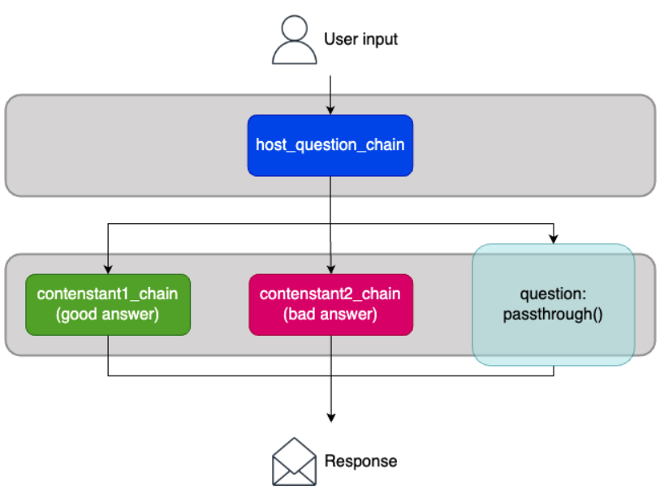

# Week 9: Lab 2 - Creating AI Assistants with LangChain

## Lab overview

You’ve been tasked with creating AI tools that will revolutionize the world of trivia nights. Your friend, a trivia host extraordinaire, has been stuck in the Stone Age of trivia hosting, using encyclopedias to do research and their begrudging friends to practice with. It’s time to bring their game into the 21st century!

Using the LangChain framework, you will use chains, local memory, in-cloud memory, and more, to create invitations, conduct research, craft questions, and build a trivia chatbot assistant.

In this lab, you’ll face various challenges on your way to creating the ultimate DynamoDB-backed AI GUI (graphical user interface) for trivia hosting.

Objectives
By the end of this lab, you will be able to do the following:

Organize LangChain components using chains and pipes.
Chain runnables in parallel and in sequence.
Manage in-memory conversation history in a variety of ways.
Use DynamoDB to give an AI application statefullness.
Integrate AI tools into a GUI with Streamlit.
Icon key
Various icons are used throughout this lab to call attention to different types of instructions and notes. The following list explains the purpose for each icon:

 Caution: Information of special interest or importance (not so important to cause problems with the equipment or data if you miss it, but it could result in the need to repeat certain steps).
 Command: A command that you must run.
 Expected output: A sample output that you can use to verify the output of a command or edited file.
 Hint: A hint to a question or challenge.
 Note: A hint, tip, or important guidance.
 Task complete: A conclusion or summary point in the lab.
 Warning: An action that is irreversible and could potentially impact the failure of a command or process (including warnings about configurations that cannot be changed after they are made).
Start lab
To launch the lab, at the top of the page, choose Start Lab.

 Caution: You must wait for the provisioned AWS services to be ready before you can continue.

To open the lab, choose Open Console .

You are automatically signed in to the AWS Management Console in a new web browser tab.

 Warning: Do not change the Region unless instructed.

Common sign-in errors
Error: Choosing Start Lab has no effect
In some cases, certain pop-up or script blocker web browser extensions might prevent the Start Lab button from working as intended. If you experience an issue starting the lab:

Add the lab domain name to your pop-up or script blocker’s allow list or turn it off.
Refresh the page and try again.
AWS services used in this lab
Amazon Bedrock
Amazon Bedrock is a fully managed service that offers a choice of high-performing foundation models (FMs) from leading AI companies through a single API. It provides a broad set of capabilities to build generative AI applications with security, privacy, and responsible AI.

Amazon DynamoDB
Amazon DynamoDB is a fully managed, serverless NoSQL database service provided by Amazon Web Services (AWS). It is designed to handle massive amounts of data and traffic with low latency and high availability. As a memory store for a large language model (LLM) chatbot, DynamoDB can efficiently store and retrieve the conversation history, user preferences, and other relevant data, enabling the chatbot to provide personalized and context-aware responses.

---

### Task 1: Enable Bedrock model access

In this task, you will request access to the models used in this lab in the Amazon Bedrock console.

At the top of the AWS Management Console, in the search bar, search for and choose Amazon Bedrock.
Challenge: Request access to Amazon Nova Lite model
In this challenge, you will complete the necessary steps to request access to Amazon Nova Lite model.

To view the solution to request access, expand this section.
In the left navigation pane, scroll down to Bedrock configurations and choose Model access.

Choose Enable specific models at the top of the screen.

Select the checkbox next to Amazon Nova Lite.

Choose Next.

Choose Submit.

 Expected output: Once the request succeeds, Amazon Bedrock changes the Access status to  Access granted.

 Task complete: You requested the Amazon Bedrock models needed for this lab.

---

### Task 2: Launch an interactive development environment

In this task, you will access an interactive development environment (IDE) hosted on an EC2 instance.

From the panel to the left of the lab instructions, copy the LabWorkspaceURL URL value and paste it into a new browser tab.

A page displays that prompts you to enter a password.

Copy the LabWorkspacePassword value from the panel to the left of these instructions, paste it in the Password field and login.

A Visual Studio Code integrated development environment (IDE) displays.

 Note: Prior experience with this IDE is not required.

 Command: To create a Python virtual environment and install the needed libraries, from the terminal of the IDE, run the following commands:


python -m venv my_venv
source my_venv/bin/activate
pip install -r requirements.txt
 Caution: If a pop-up prompts you to choose whether “See text and images copied to the clipboard,” select Allow.

If you get a notification that asks whether you want to select the new virtual environment as your workspace folder, select No.

 Expected output:


************************
**** EXAMPLE OUTPUT ****
************************

Collecting langchain (from -r requirements.txt (line 1))
  Downloading langchain-0.3.7-py3-none-any.whl.metadata (7.1 kB)
...
Successfully installed MarkupSafe-3.0.2 PyYAML-6.0.2 SQLAlchemy-2.0.35
...
 Task complete: You accessed the lab environment IDE.

---

### Task 3: Make promotions using LLMChain

In this task, you will use your first LangChain chain to make a tool that creates promotional flyers for trivia nights.

In the activity bar at the left of the page, choose the  Explorer icon to open the lab directory.

Choose the trivia, then chains, then promotion_maker.py.

This Python file leverages LangChain components you should be familiar with:

ChatBedrock: A chat model object to interact with Amazon Bedrock chat models like Nova Lite
PromptTemplate: A template used with LLM objects to inject inputs into a standard prompt design, creating prompts as strings.
It introduces LLMChain. A chain can organize LangChain components, or runnables, in a multitude of ways. LLMChain is one of the simplest chains. It takes an LLM and a prompt or prompt template as parameters.


Image description: An LLMChain takes a prompt template and an LLM as parameters, as well as inputs to create a prompt from a prompt template.

Read through promotion_maker.py, examining what each component is doing to create promotional content.

In the code below, LLMChain takes an LLM and a prompt_template as parameters. When its invoke function is run with inputs, it passes those inputs to the prompt template to create a prompt, and passes that prompt to the LLM.


chain = LLMChain(llm = nova_llm, prompt = prompt_template)
The file is complete except variable passing for invocation of the chain.

To complete the code, replace <FMI-1>, <FMI-2>, <FMI-3> “Fill Me In” values with the appropriate variables.
Solution

# Invoke the LLMChain and save the response
response = chain.invoke(
    {
        "theme": theme,
        "time": time_of,
        "location": location,
    }
)
To save the file, on Windows, press Ctrl + S and, on Mac, press command + S.

 Command: To change directories to the directory containing the chains, run the following command:


cd trivia/chains
 Command: To execute the script, run the following code:


python promotion_maker.py
 Expected output: An awesome flyer for an Astronomy trivia night in October is printed in your terminal!

 Note: A warning in your terminal notifies you that LLMChain will be removed in the next major release of LangChain. In the next task, you will learn how to use LLMChain’s replacement.

 Task complete: You built a promotion maker using LangChain’s LLMChain.

---

### Task 4: Write reports with pipes

In this task, you will begin piping together LangChain components to build chains and create reports to help your friend ideate trivia questions.

In the activity bar at the left of the page, choose the  Explorer icon to open the lab directory.

Choose the trivia, then chains, then report_writer.py.

report_writer.py introduces another LangChain capability, the pipe operator, |. Any LangChain runnable, including those LangChain gives you (Prompts, LLMs, ChatModels, OutputParsers…) and those you define, can be invoked. Rather than use LLMChain, you can organize events in LangChain by creating a runnable out of runnables.

Read through report_writer.py, examining what each component is doing to create a report on a trivia topic.

In the below code, chain operates in the same was as LLMChain did, but with a simpler and more extendable notation. At invocation time, variables are passed to a prompt template, which creates a prompt, which is passed to a model.

```python
chain = prompt_template | nova_chat
```


Image description: chain runs a prompt template and passes its output to an LLM to create an LLM response. These elements are piped together.

The file is complete except variable passing for the invocation of the chain.
To complete the code, replace the <FMI-4> “Fill Me In” value with the appropriate code.

 Hint: The arguments for chain invocation are merely the inputs to the first runnable in the chain, the prompt template. Use the chain’s invoke function with the following as the argument: a dict holding a key that is a placeholder in the prompt template and a value that was passed to the function.

Solution

```python
response = chain.invoke({"topic": topic})
```

To save the file, on Windows, press Ctrl + S and, on Mac, press command + S.

 Command: To execute the script, run the following code from the terminal:

```sh
python report_writer.py
```

 Expected output: A handy LLM generated report on the Big Dipper.

 Task complete: You made a report writer by piping together LangChain components.

---

### Task 5: Simulate trivia using runnables, sequential chaining, and parallel chaining

In this task, you will use the pipe operator and RunnableParallel to make chains… out of chains, on your way to building a trivia simulator to help your friend practice hosting.

#### Task 5.1: Run the trivia simulator

Examine and execute the Python file to use the LangChain trivia simulator.

In the activity bar at the left of the page, choose the  Explorer icon to open the lab directory.

Choose the trivia, then chains, then trivia_simulator.py.

This tool is being built to give your practice hosting trivia. trivia_simulator.py is a functional file that takes a trivia topic and returns an LLM-generated question, correct answer, and not so correct answer. The question is used as an input variable for the two answer chains. Here you are chaining chains. This is organized within a master chain:

```python
master_chain = (
    host_question_chain | 
    RunnableParallel({"answer1" : contestant1_chain, "answer2" : contestant2_chain, "question": RunnablePassthrough()})
)
```

This script adds another capability of LangChain. Parallel chain/runnable invocation allows for parallel model invocation to reduce runtime in more complex chains. The master chain contains a RunnableParallel, in which both contestant answer chains run independently and simultaneously as the input to both is the output of the question chain. The RunnablePassthrough passes the unmodified input of what invoked it.



Image description: Trivia simulator’s master chain returns the responses of two trivia competitors and the initial question, all generated with a LLM.

 Command: To execute the script, run the following code from the terminal:


python trivia_simulator.py
 Expected output: Three lines of output in the following format:


What is the largest planet in our solar system?
Jupiter.
Saturn.
Line 1: A trivia question
Line 2: The correct answer as plain text ending with a period
Line 3: An incorrect answer enclosed in double quotes ending with a period

---

### Task 5.2: Extend the trivia simulator

To extend the functionality of the trivia simulator, add contestant response judging chain to the master chain.


Image description: The master chain with a judging chain added.

Underneath ## ADD HOST JUDGING TEMPLATE HERE within the file, create a prompt template to pick the correct answer, given two answers and a question.

The prompt template should have 3 variables, one for each of the original question asked by the host, contestant 1’s answer, and contestant 2’s answer. It should provide context to the LLM for what each question or answer represents. Finally, it should prompt the LLM to pick a correct answer.

Solution

## ADD HOST JUDGING TEMPLATE HERE
host_judge_template = PromptTemplate(
    input_variables =["question", "answer1", "answer2"],
    template = """User: You're the judge of a contest. Given a question and two answers: Answer 1 and Answer 2, you should pick the correct answer in 3 sentences and be funny about it.
The question is "{question}".
Marissa's answer is "{answer1}".
Diego's answer is "{answer2}".

Assistant: """)
Underneath ## ADD HOST JUDGING CHAIN HERE within the file, create a chain that pipes together the prompt template for judging, the LLM, and a StrOutputParser.
Solution

## ADD HOST JUDGING CHAIN HERE
host_judge_chain = host_judge_template | nova_llm | StrOutputParser()
To incorporate the judging chain into the master chain, modify the master chain. Pipe on an additional RunnableParallel, running host_judge_chain and assigning it to the “host” key, and a RunnablePassthrough(), assigning that to a key called “passthrough”.

A RunnablePassthrough passes an input unchanged to the next runnable.

Solution

master_chain = (
    host_question_chain | 
    RunnableParallel({"answer1" : contestant1_chain, "answer2" : contestant2_chain, "question": RunnablePassthrough()}) |
    RunnableParallel({"host" : host_judge_chain, "passthrough":RunnablePassthrough()})
)
To modify the response_list to capture the responses from the new chain, replace the value for response_list assignment with the following code that indexes the passthrough and host primary keys of the response object:


response_list = [response['passthrough']['question'], response['passthrough']['answer1'], response['passthrough']['answer2'], response.get('host', 'key not found')]
To save the file, on Windows, press Ctrl + S and, on Mac, press command + S.

 Command: To execute the script again, run the following code from the terminal:


python trivia_simulator.py
 Expected output: Four lines of output in the following format:


What is the largest planet in our solar system?
Jupiter.
Saturn.
Well, well, well! Marissa nailed it with Jupiter - that gas giant is indeed the heavyweight champion of our solar system. Diego's Saturn answer, while a beautiful ringed planet, is like bringing a knife to a gunfight in the size department. Marissa takes this round!
Line 1: A trivia question
Line 2: The correct answer as plain text ending with a period
Line 3: An incorrect answeras plain text ending with a period
Line 4: Host commentary that humorously judges the answers and identifies the correct contestant (Marissa or Diego)
 Task complete: You created a trivia simulator by using runnables in sequence and in parallel.

Task 6: Build in-memory chatbots
Up to this point in the lab, no tools you’ve created have been stateful, meaning they have no context of previous prompts and responses. LangChain has useful classes for managing memory for chatbots and other LLM applications. In this task, you will use several LangChain strategies for local memory management to build trivia assistant chatbots, for trivia night preparation and night-of assistance.

Task 6.1: Buffer memory
Objects from the langchain.memory library can easily be added to chains to store message history. ConversationBufferMemory, a buffer for storing conversation memory, is the simplest.

In the activity bar at the left of the page, choose the  Explorer icon to open the lab directory.

Choose the trivia, then chains, then buffer_chat.py.

The chatbot code you see is functional, but is not stateful.

Modify prompt_template by adding 'history' to its input variables.

Modify prompt_template by adding the following line to the template:


chat_history : {history}
Modify chain by adding the following to its parameters:


memory = ConversationBufferMemory()
 Note: ConversationBufferMemory manages message retention and its value is passed to the {history} variable in the prompt template each time the LLMChain is invoked.

Solution

prompt_template = PromptTemplate(
    input_variables=['history', 'input'],
    template="""You are an assistant for a bar trivia night.
chat_history : {history}
User: {input}
AI: """)

# Use LLMChain to pass an input and conversation history to the chat model
# Set memory to ConversationBufferMemory()
# Set verbose as true to see inputs and output for each runnable of the chain
chain = LLMChain(llm = nova_chat, prompt = prompt_template, memory = ConversationBufferMemory(), verbose = True)
To save the file, on Windows, press Ctrl + S and, on Mac, press command + S.

 Command: To execute the script, run the following code from the terminal:


python buffer_chat.py
 Note: Notice verbose = True, allowing you to see the full behavior of the chain.

 Expected output: Two LLM responses: the first talking about the oceans of Europa, the second, elaborating on the first response, indicating the chatbot is stateful.

Task 6.2: Buffer window memory
Use ConversationBufferWindowMemory to create a more memory-efficient chatbot, suited to long conversations.

Imagine a 100 question exchange with a chatbot using ConversationBufferMemory. One hundred prompts and responses are sent as context along with the new prompt to an LLM. Such a memory management system, has no recency focus and becomes massively inefficient in terms of performance and cost, especially for models with input token limits.

ConversationBufferWindowMemory solves that problem by only storing and sending the only last k messages.

In the activity bar at the left of the page, choose the  Explorer icon to open the lab directory.

Choose the trivia, then chains, then window_chat.py.

 Command: To execute the script, run the following code from the terminal:


python window_chat.py
 Expected output: The chatbot’s responses indicate it cannot track the conversation well.

Because k=1, the buffer window is only the last message.

To extend the utility of this chatbot, modify ConversationBufferWindowMemory to extend the number of messages stored in its buffer to 5.

Solution

chain = ConversationChain(llm = nova_chat, memory = ConversationBufferWindowMemory(k = 5), verbose = True)
To save the file, on Windows, press Ctrl + S and, on Mac, press command + S.

 Command: To execute the script again, run the following code from the terminal:


python window_chat.py
 Expected output: The chatbot recalls the last 5 messages and can track a conversation better.

Task 6.3: Summary memory
Use ConversationSummaryMemory to create a chatbot that uses a summary of the conversation as context for each LLM invocation.

Instead of storing and using a list of messages as context, ConversationSummaryMemory uses an LLM to create a summary of the conversation after each invocation and uses that as context. Its efficient for long conversations and mimics the way humans can retain key points of a discussion.

In the activity bar at the left of the page, choose the  Explorer icon to open the lab directory.

Choose the trivia, then chains, then summary_chat.py.

In the below code from that file, a ConversationChain uses a ConversationSummaryMemory object with a an LLM as a parameter. That LLM summarizes the conversation. And the llm parameter of ConversationChain is a separate chat model:


chain = ConversationChain(llm = nova_chat, memory = ConversationSummaryMemory(llm = nova_llm), verbose = True)
 Command: To execute the script, run the following code from the terminal:


python summary_chat.py
 Expected output: View the conversation summary from the terminal output to see the LLM summarizing the chat and passing it as context to subsequent invocations.

 Task complete: You leveraged LangChain memory components to make stateful chatbots.

Task 7: Give chatbots a cloud memory store
In this task, you will create a chatbot that uses Amazon DynamoDB as a message memory store.

While in-memory storage can offer low-latency and high-performance for certain use cases, it may not be the best choice for building scalable and durable chatbot applications that need to handle large amounts of data and high concurrency. A cloud data store for LLM messages unlocks persistance, scalability, and distributed access. Conversations can be resumed from different access points and data retention governance standards can be abided by.

In the activity bar at the left of the page, choose the  Explorer icon to open the lab directory.

Choose the trivia, then chains, then dynamodb_chat.py.

The script works as is, has all the AWS resources necessary to use DynamoDB, but does not yet have all the LangChain code necessary to implement a DynamoDB message store.

Modify prompt_template to add a MessagesPlaceholder, a placeholder which can be used to pass a list of messages.

Use LangChain MessagesPlaceholder documentation to learn the syntax you need to use and then check your solution.

Solution

prompt_template = ChatPromptTemplate.from_messages(
    [
        ("system", "You are an assistant for a bar trivia night."),
        MessagesPlaceholder("history"),
        ("human", "{question}"),
    ]
)
The dynamodb_chat function is currently invoking a chain without memory.

To create a chain that leverages DynamoDB memory, add the following code to the Python file:


global chain_with_history
chain_with_history = RunnableWithMessageHistory(
                    chain,
                    lambda session_id: DynamoDBChatMessageHistory(
                        table_name = table_name, session_id = session_id
                    ),
                    input_messages_key="question",
                    history_messages_key="history")
 Note: RunnableWithMessageHistory is a runnable that manages message history for another runnable. The key parameters correspond to the settings stipulated in the prompt_template. The lambda function takes a session_id as an argument and returns a DynamoDBChatMessageHistory instance.

To invoke the chain with history rather than the chain without it, change the chain invocation in the dynamodb_chat function to be the following:


response = chain_with_history.invoke({"question" : input}, config = {"configurable": {"session_id": "1"}})
To save the file, on Windows, press Ctrl + S and, on Mac, press command + S.

 Command: To execute the script, run the following code from the terminal:


python dynamodb_chat.py
 Expected output: The chatbot litigated the dispute between two contestants and on its second invocation, clearly demonstrated its awareness of the first invocation. It has in-cloud memory!

 Task complete: You assured conversation memory can be retained and accessed anywhere, anytime with DynamoDB.

Task 8: Add a Streamlit GUI
In this task, you will package up all the tools you built in an efficient and usable graphical user interface (GUI) using Streamlit, giving your friend an all-in-one trivia tool!

All the chains you built are made available as modules to the Streamlit application. They are each wrapped in selection logic and invoked from the app.

 Command: To change directories to the directory containing the Streamlit app, run the following command:


cd ..
 Command: To execute the script, run the following code from the terminal:


streamlit run app.py
To open the Streamlit app, choose Open in browser.

Test the chains in the app, as your friend prepares to host his first trivia night on October 12, Astronomy Day! (But, feel free to input whatever you’d like to test out the chains you’ve built.)

Astronomy Day is a semi-annual holiday in the United States to raise the interest of the general public in astronomy. On this night, space enjoyers celebrate the observable universe by looking up through their telescopes. Hoping these stargazing enthusiasts want to pre-game their midnight stellar observations by proving they’re the most knowledgeable astronomer in the galaxy, a local pub has planned an outer-space trivia night. And your friend is hosting. Create a flyer for the occasion.

 Note: If you encounter any errors, it’s likely your code is incorrect in some way. Feel free to debug with the assistance of the lab instructions if you’d like.

Within the app, select Promotion Maker, enter the following, and select Submit:
Theme: Astronomy Day
Time: October 12, 7 PM
Location: The Local Pub
Select Report Writer, enter Egyptian Astronomy, and press Enter/return.

Select Trivia Simulator, enter astronomical instruments, and press Enter/return.

Select Chat and try out each memory strategy.

 Note: For dynamodb, make sure you create a database before attempting to converse with the chatbot.

 Task complete: You integrated your chains into a a usable application.

Conclusion
 Congratulations! You successfully did the following:

Organized LangChain components using chains and pipes.
Chained runnables in parallel and in sequence.
Managed in-memory conversation history in a variety of ways.
Used DynamoDB to give an AI application statefullness.
Integrated AI tools into a GUI with Streamlit.
End lab
Follow these steps to close the console and end your lab.

Return to the AWS Management Console.

At the upper-right corner of the page, choose AWSLabsUser, and then choose Sign out.

Choose End Lab and then confirm that you want to end your lab.
