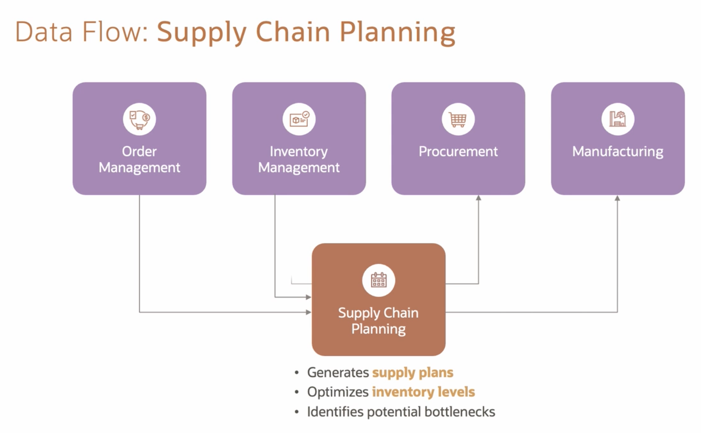
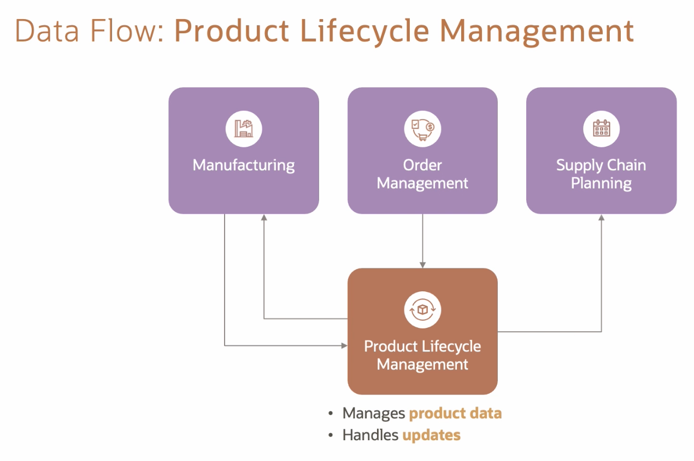
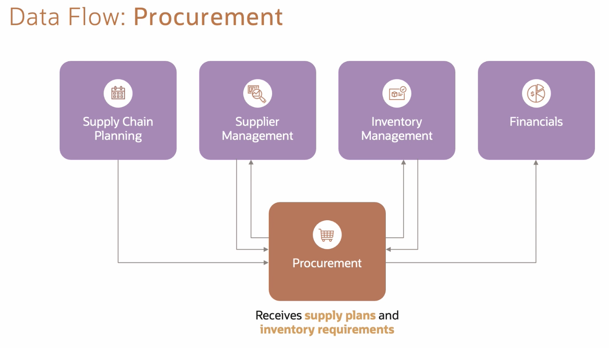
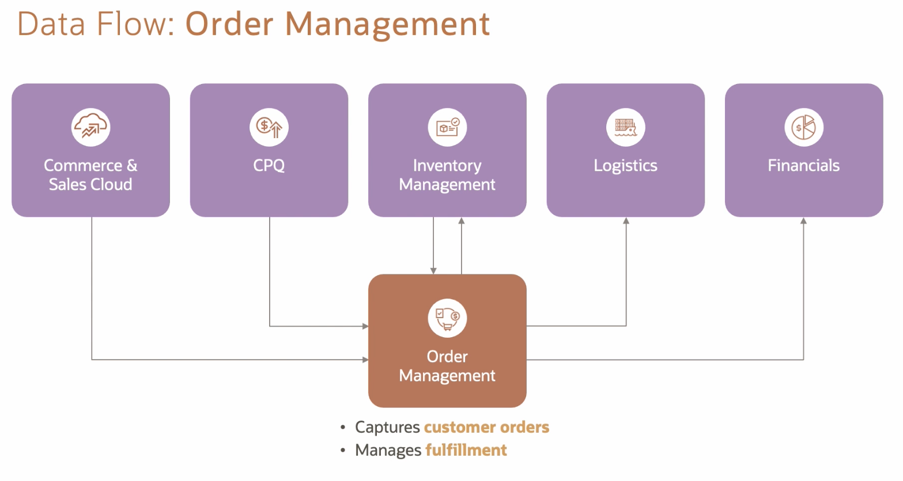
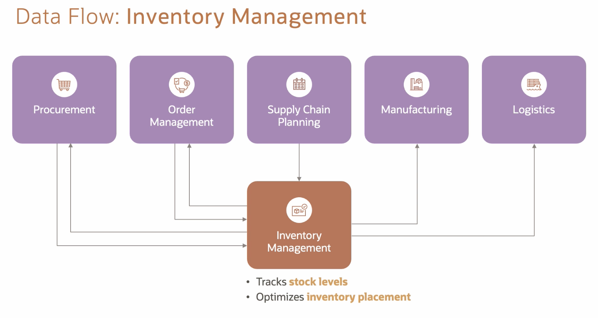
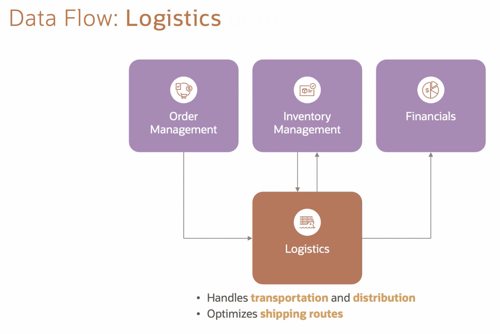
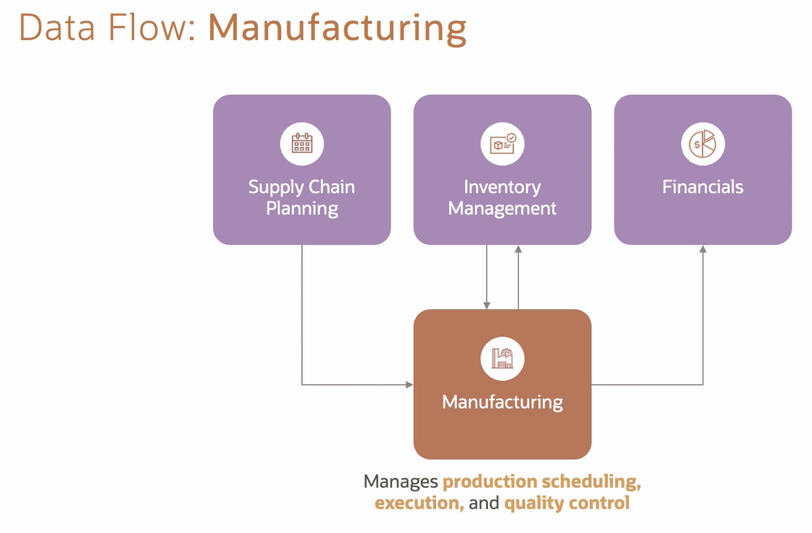
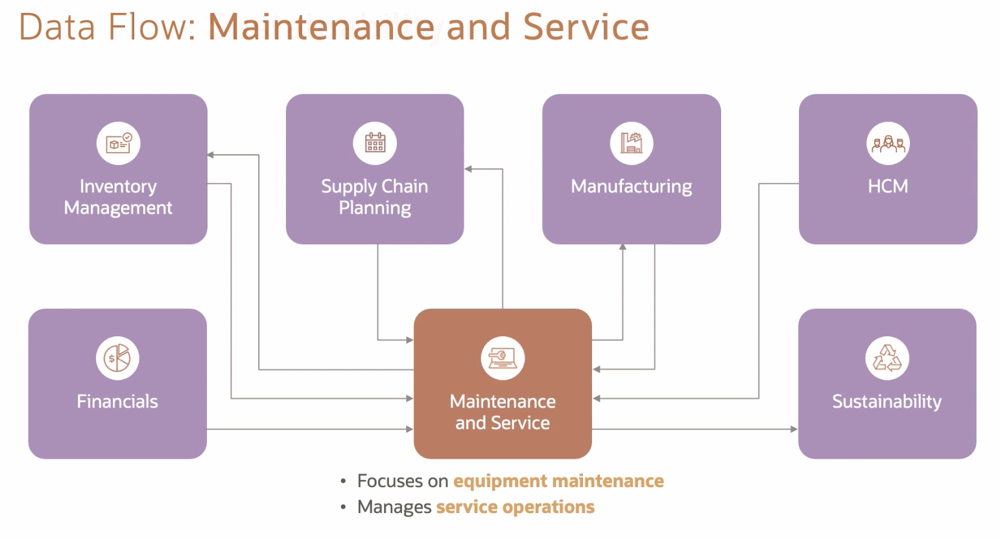
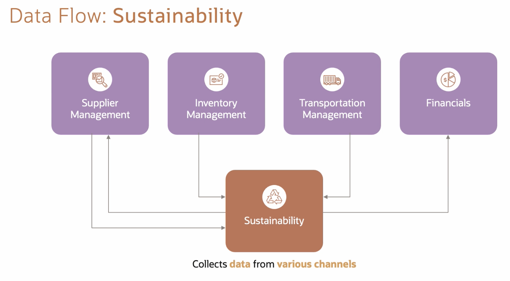

# Supply Chain and Manufacturing SCM

* back to repo's main [README.md](../../README.md)
* back to [Cloud related cheatsheet](./cloud.md)
* back to [Oracle Cloud Infrastructure](../cloud/oracle.md)

## Oracle Fusion Cloud Applications

* **HCM** Human Capital Management
* **ERP** Enterprise Resource Planning
* **SCM** Supply Chain and Manufacturing
* **CX** Customer Experience

## Oracle Fusion Cloud SCM - optimizing the Supply Chain

### Supply chain

* Planning: Strategic, tactical, and operational
* Sourcing/Manufacturing: Accurate supply and demand
* Inventory Management/Warehousing: Right goods/services
* Fulfillment and Delivery: Pick, pack, ship, receive, recognize
* Servicing: Return, cancel, amend, renew

### Oracle Fusion Cloud SCM: Modules

* Planning
  * Supply Planning
  * Sales and Operations Planning
  * Supply Chain Collaboration
  * Collaboration Messaging Framework
  * Demand Management
* Sourcing/Manufacturing
  * Procurement
  * Supplier Qualification Management
  * Supplier Portal
  * Sourcing
  * Procurements Contracts
  * Supplier Model
  * Spend Classification
  * Manufacturing
  * Smart Operations
  * Production Scheduling
  * WIP
  * Quality Management
  * Cost Management
* Inventory Management/Warehousing
  * Inventory Management
  * Receiving
  * Shipping
  * Supply Chain Financial Orchestration
  * Product Management
  * Product Recall Management
  * Cost Management
  * Warehouse Management
* Fulfillment and Delivery
  * Order Management
  * Configuration
  * Pricing
  * Supply Chain Orchestration
  * Global Order Promising
  * Transportation Management
  * Global Trade Management
* Servicing
  * Maintenance
  * Service Logistics

### Oracle Fusion Cloud SCM Characteristics

* Agile
* Resilient

#### Using

* AI
* ML
* Blockchain

#### Oracle Cloud Infrastructure

* AI/ML
* Extensibility
* Integration
* Security
* Autonomous Database

## Oracle Modern Bets Practice

### Summary

* OMBP comprises industry-standard processes powered by Oracle technology, simplifying and optimizing workflows in Fusion Applications.
* OMBP delivers success through key differentiators: tools, technologies, approaches, strategies...
* OMBP can be used throughout different functional areas of a business.
* OMBP contains process steps, a list of technologies amd platforms used, and key metrics.

## Supply Chain Management

### Introducing Supply Chain Management (SCM)

#### Oracle Fusion Cloud SCM

* Supply Chain Visibility
* Data-Driven Decision Making
* Streamlined Planning
* Efficient Procurement and Sourcing
* Omnichannel Order Management
* Optimized Inventory Management
* Responsive Logistics
* Scalability and Flexibility
* Integration (with other Oracle Fusion Modules)
* Continuous Innovation

#### Key Modules of Oracle Cloud SCM

* Supply Chain Planning
  * Balances supply and demand
  * Optimizes inventory levels
  * Improves forecast accuracy
* Product Lifecycle Management
  * Manages concept to retirement
  * Provides development tools
  * Ensures data accuracy
* Procurement
  * Streamlines processes
  * Enables collaborative procurement
* Order Management
  * Streamlines customer orders
  * Ensures accurate order promising and pricing
* Inventory Management
  * Optimizes stock levels
  * Provides real-time visibility
* Logistics
  * Optimizes transportation and distribution
* Manufacturing
  * Offers production management capabilities
  * Optimizes production
* Maintenance and Service
  * Supports asset-intensive industries
* Supply Chain Analytics
  * Offers robust analytics and reporting capabilities
  * Enables continuous process improvement
* Sustainability
  * Offers positive change

### Standard features across all modules

* Reporting
* Analytics

### Data Flow: Supply Chain Planning

### Data Flow: Product Lifecycle Management

### Data Flow: Procurement

### Data Flow: Order Management

### Data Flow: Inventory Management

### Data Flow: Logistics

### Data Flow: Manufacturing

### Data Flow: Maintenance and Service

### Data Flow: Sustainability

#### Summary

* Oracle Cloud SCM optimizes supply chain operations with a comprehensive suite of capabilities.
* It enables organizations to streamline their supply chain processes.
* It ensures seamless integration and real-time data synchronization across the SCM modules.

### OMBPs within Supply Chan Management

## Innovation: Design to Release

### What is Oracle Innovation Management?

#### Product Lifecycle Management

* Innovation Management
* Product Development
* Product Information Management

INNOVATE -> DEVELOP -> COMMERCIALIZE

### Primary Solutions in Innovation Management

* Ideation Management: Capture, collect, and manage ideas
* Product Requirements: Define, manage, and track requirements
* Product Concept Design: Generate, analyze, and approve concepts
* Proposal Management: Generate, analyze, and approve proposals

### OMBP Design to Release: Process Steps

* Review Product Design
* Develop Product
* Collaborate with Suppliers
* Establish Product Costs
* Evaluate Readiness
* Release to Production

### Design to Release: Key Metrics

* Material cost
* Resource cost
* Overhead cost

### Design to Release: Key Takeaways

* Use the Ideation dashboard to effectively review and analyze ideas
* Communicate securely with internal and external stakeholders
* Navigate seamlessly between Innovation Management and Product Development Cloud
* Determine product release effectively by using Product Design dashboards
* Ensure a controlled product release through the data governance process

### Skill Check: Innovation Design to Release OMBP

#### How can suppliers suggest existing product updates to product managers?

* Using the Ideation dashboard
* Using the Product Development work area
* **Using the Supplier portal**

#### Which two are primary solutions in Oracle Innovation Management?

* **Proposal Management**
* Invoice Management
* Order Management
* **Ideation Management**

#### Resource cost refers to ongoing business expenses, sucj as rent and utilities, that a company incurs to maintain its operations

* True
* **False** [The answer: Overhead cost]

## Supply Chain Planning OMBP

* Integrated Business Plan to Execution
* Demand to Management
* Demand Forecast to Supply Plan

### Integrated Business Plan to Execution

### Demand to Management

### Demand Forecast to Supply Plan

### Skill Check: Supply Chain Planning

#### Which process step in the Demand Forecast to Supply Plan OMBP involved actions such as expediting open orders and adding capacity?

* Align Financial Goals
* Shape Demand
* Release Orders
* **Address Supply Issues**

#### Which applications belong to the Supply Chain Planning suite?

* **Sales and Operations Planning, Demand Management, and Supply Planning**
* Rapid Planning, Service Plan Planning, and Inventory Optimization
* Inventory Management, Product Information Management, and Order Management
* Sales Planning, Inventory Planning, and Distribution Planning

#### What is a commonly used measurement of forecast error in Oracle Cloud Demand Management?

* Tracking Signal
* Fulfillment Percentage
* Root Mean Squared Error
* **MAPE**

#### The Supply Chain Planning suite is a backward-looking set of applications focused on cataloging historical performance

* True
* **False**

#### Which Oracle Modern Best Practice focuses on managing planning cycles for a longer planning horizon?

* Insight to Sourcing
* Replenishment Plan to Purchase Aggregation
* Demand Forecast to Supply Chain
* **Integrated Business Plan to Execution**

## Procurement OMBP

* Supplier Registration to Spend Compliance
* Insight to Sourcing
* Contract Creation to Procurement Compliance
* Requisition to Payment
* Supplier Invoice to Payment

### Supplier Registration to Spend Compliance

### Insight to Sourcing

### Contract Creation to Procurement Compliance

### Requisition to Payment

### Supplier Invoice to Payment
